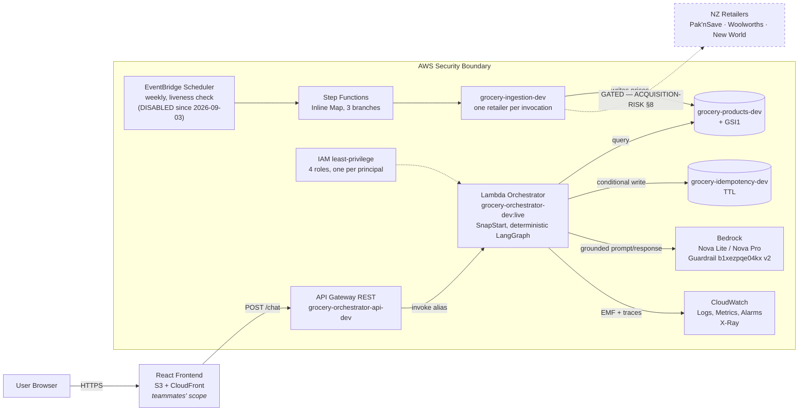

# Deployed architecture — dev

Reconciliation of the reviewed architecture diagram against
`.kiro/specs/design.md` and the `ap-southeast-2` account, plus the record of
what is deployed. Dated 2026-08-27, amended 2026-08-29.

**What changed on 2026-08-29:** the Guardrail moved to **version 2** after the
live red-team run found it refusing benign grocery queries (the foraging topic
was scoped to an ingredient rather than an activity); PITR was enabled on the
two upstream data tables and deliberately left off the idempotency cache; and
the idempotency table's claims became owner-fenced, verified against the real
table. The application-layer Pilot Tasks 1-7 are closed.

**Corrected 2026-08-30.** The 2026-08-29 amendment previously claimed "nothing
here is deployed as a service yet — the Lambda, API Gateway and alias in the
diagram below are the TARGET shape, not the current account." **That was
false.** It contradicted §3, §5 and §6 of this same file, which were correct,
and it propagated into the README, `AGENTS.md` and `infra/docs/00`. Everything
in §3 was re-verified against the account on 2026-08-30 and all of it exists.
Nothing in the diagram below is aspirational except the dashed retailer link
and the S3/CloudFront frontend.

The correction is worth more than the fact. A document describing intent was
edited to overrule a document describing an account, and four files then agreed
with each other and disagreed with AWS — the same shape as every other finding
in this repository: **a claim that looked verified because other claims matched
it.** Check the account.

This file is the **deployment record**: what exists in the account, what it is
wired to, and what was learned deploying it. `AGENTS.md` remains the working
agreement and `.kiro/specs/` remains the specification — neither is superseded
here. When they disagree with this file, they are describing intent and this
file is describing an account, and both are worth reading.

The diagram was a **presentation view of the architecture already specified**,
not a change to it. Four things needed correcting before it could be built;
those are §2.

---

## 1. Shape



Only the retailer link is dashed. Everything else is deployed and was exercised.

## 2. Corrections applied to the diagram

**The price arrow terminated at Bedrock.** Drawn literally, ingestion would
feed prices into the model rather than into storage, inverting invariant 1 —
no price may originate from model generation. Prices land in
`grocery-products-dev`; Bedrock reads only the prompt the orchestrator builds
from already-retrieved records.

**Step Functions was missing.** The diagram went `EventBridge -> one Lambda ->
three retailers`. `tech.md`, `design.md:33` and `tasks.md:94` all specify
`EventBridge -> Step Functions Inline Map -> per-source adapters`. The specs
win, and the reason is now load-bearing in the deployed definition: `Catch`
sits *inside* the item processor, so a retailer that fails does not abort the
Map and discard the retailers that already succeeded.

**"Sessions" is the idempotency table.** The account has products and
idempotency; there is no sessions table and none is planned for the pilot.
`grocery-idempotency-dev` is already session-scoped with TTL. A genuine
conversation-state store would open a Privacy Act 2020 workstream first —
`security.md` line 25.

**EventBridge and ingestion sat outside the security boundary.** They are AWS
services inside the account. Only the retailer sources are external, and that
is the boundary worth drawing, because it is where untrusted data enters.

## 3. What is deployed

**Every row below was re-verified against the account on 2026-08-30** with
`aws apigateway get-rest-apis`, `lambda list-aliases`, `apigateway get-stages`
and `scheduler list-schedules`, plus a live `POST /dev/chat` returning HTTP 200.
All of it exists.

| Resource | Identifier | Notes |
|---|---|---|
| Orchestrator Lambda | `grocery-orchestrator-dev` | python3.13, x86_64, 1024 MB, 30 s, X-Ray Active |
| Published version / alias | **`12`** / `:live`, with **`13` built and held** | SnapStart `OptimizationStatus: On`. v6–v11 were all 2026-08-30; **v12 published 2026-09-04** from `6270c0a`, the first orchestrator deploy since (§3v). **v13** (`0467747`) carries the degraded-intent routing fix and was PROVEN live under Task 16 gate G6 Phase B — 0 clarifications on a complete request where v12 gave 14 of 24 — then the alias was rolled back to 12 **pending the frontend merge**. Promote v13 at the frontend cutover. Rollback from either: point the alias at the previous version |
| Orchestrator role | `grocery-orchestrator-dev-role` | `config/iam-orchestrator-role.json` |
| REST API | `grocery-orchestrator-api-dev` (`woqmel35lk`) | regional, stage `dev`, throttle 5 rps / burst 10, X-Ray tracing ON (enabled 2026-08-30) |
| Endpoint | `POST /dev/chat` | unauthenticated; see §7 |
| Ingestion Lambda | `grocery-ingestion-dev` | 512 MB, 120 s, handler `ingestion.handler.lambda_handler`. **Deployed 2026-09-04** (§3u) — before that the account ran the 2026-08-27 build, which contained neither `reject_implausible` nor the history write. Env: `PRODUCTS_TABLE`, `PRICE_SOURCE=lineage_b` |
| Ingestion role | `grocery-ingestion-dev-role` | `config/iam-ingestion-role.json`; Query/Put/BatchWrite on products, **append-only (Put/BatchWrite, no reads) on price-history since 2026-09-04**, no Bedrock, no idempotency |
| State machine | `grocery-ingestion-dev` | `config/ingestion-state-machine.json` |
| Schedule | `grocery-price-refresh-dev` | **DISABLED 2026-09-03** (it was re-injecting the fixture catalogue nightly). Decision 2026-09-04: return as a WEEKLY liveness check, not a refresh — see `config/data-sources.json` `_what_the_weekly_refresh_is_actually_for`. Not codified; lives only in the account |
| Products table | `grocery-products-dev` | **2,759 items**, the real catalogue only, GSI1 + GSI2, PAY_PER_REQUEST |
| Price-history table | `grocery-price-history-dev` | **Created 2026-09-04** by `Grocery-Stateful-dev` — the first resource this project's CDK has created rather than adopted. `history_pk`/`valid_date`, PAY_PER_REQUEST, no GSI, no PITR, RETAIN. 2,759 rows |
| Idempotency table | `grocery-idempotency-dev` | TTL ACTIVE |
| Guardrail | `b1xezpqe04kx` version `2` | v2 published 2026-08-29; DRAFT deliberately not granted in IAM |
| CDK stacks (deployed) | `Grocery-Stateful-dev`, `Grocery-Service-dev` | bootstrapped 2026-08-30; service plane deployed in parallel under `-cdk`, see §3m. `Grocery-Obs`, `-Ingestion`, `-Frontend`, `-Reviewer` are DEFINED in `infra/` but NOT deployed (the Reviewer stack, ADR 0002 gate 5, also waits on the `AWS::BedrockAgentCore::Runtime` CFN type reaching ap-southeast-2 — `infra/lib/reviewer-stack.ts`). |
| SNS topic | `grocery-orchestrator-alarms-dev` | **12 alarms** (8 orchestrator + 4 ingestion, applied 2026-09-04); 2 confirmed email subscribers; Budgets granted publish |
| Dashboard | `grocery-orchestrator-dev` | 9 widgets over the EMF metrics and the gateway |
| Budget | `grocery-orchestrator-monthly-dev` | $25/month, alerts at 50/80/100% actual + 100% forecast |
| Usage plan | `grocery-orchestrator-dev-plan` (`v4yd7d`) | 5 rps / burst 10 on stage `dev`; created 2026-08-30 |

**One artefact, two functions — a property of the BUILD, and checkable in the
account.** `scripts/build_lambda.py` includes `ingestion` in `INCLUDE_DIRS` —
and, since 2026-09-04, `datasets/data/dynamodb_products`, because the deployed
refresh runs `PRICE_SOURCE=lineage_b` and has to have something to read. The same
`build/lambda.zip` is deployed to both functions with different handlers.

That it is *deployed* to both is not something the build can guarantee, and it
was FALSE in the account from 2026-08-30 to 2026-09-04 (§3v). Verify it, do not
assume it — the two functions' `CodeSha256` must be equal:

```bash
aws lambda get-function-configuration --function-name grocery-orchestrator-dev   --query CodeSha256 --output text
aws lambda get-function-configuration --function-name grocery-ingestion-dev   --query CodeSha256 --output text
``` Two zips would mean two builds to keep
in step and two artefacts for the CI `package` job to verify, for about 10 KB
of Python. The functions stay separate — separate roles, separate invocation
paths — and only the artefact is shared.

**x86_64, not arm64.** `build_lambda.py` pins
`--platform manylinux2014_x86_64` and the package carries compiled wheels
(`pydantic_core`, `orjson`, `xxhash`). Architecture is immutable after create,
so it was matched to what CI verifies rather than guessed at.

**The alias is what gets invoked, not `$LATEST`.** SnapStart applies to
published versions only. An integration pointed at the unqualified function ARN
silently forfeits it while still working — nothing breaks, it just gets slower.

## 3a. Code refreshed to current `main` — 2026-08-30

**Resolved.** Alias `live` served version `5` (published 2026-08-27) until
2026-08-30, which predated Pilot Tasks 4-7. The defect that mattered is gone:
the endpoint no longer invents a `$0` budget from a message that never
mentioned money.

| Request | v5 (until 2026-08-30) | v7 onwards |
|---|---|---|
| `feed my flat of 3 this week` | `BUDGET_INFEASIBLE`: *"I couldn't build a plan within $0"* | `clarification` asking what they want to spend |
| `cheapest butter` | five citations, presented as current | `STALE_DATA` naming the 2026-07-31 capture date |

### The published versions, and why no document states the current one

| version | what it added | recorded in |
|---|---|---|
| 5 | `main` at 2026-08-27, predating Pilot Tasks 4-7 | §3a |
| 6 | `main` at commit `2412ac3` | §3a |
| 7 | the freshness decision, 14 -> 45 days | §3c |
| 9 | `BEDROCK_GUARDRAIL_VERSION` corrected from `1` to `2` | §3f |
| 11 | the real 2,759-row catalogue, GSI2, Scan revoked | §3i, §3d |

**A VERSION NUMBER IN PROSE IS A CLAIM THAT EXPIRES AND NOTHING RE-CHECKS IT.**
Until 2026-08-31 four numbers described one alias across three documents at
once: this section said 7 while its own table header said "v6 (now)", §3f said
9 forty lines later, and `README.md` said 7 twice and 11 once, forty lines
apart in the same section. None of them was a lie when it was written; each was
a snapshot nobody went back to. It is the same shape as
`infra/test/service-stack.test.ts` saying "SKIPPED until ServiceStack is
implemented", and it has the same fix -- state the condition, not the answer.

So the table above is a HISTORY, which cannot go stale, and no document states
which version is live. One command does:

```bash
aws lambda get-alias --function-name grocery-orchestrator-dev --name live     --query FunctionVersion --output text
```

`AGENTS.md` already required running it before quoting a live behaviour as
current. What has changed is that no document now offers a number to quote
instead.

### How it was done, and why not the four commands this section used to give

The procedure previously written here -- build, update code, publish, move the
alias -- moves the alias before anything has invoked the new version. Two
reasons that is the wrong order here:

- **`build_lambda.py` cannot verify its own archive on Windows.** It says so and
  skips the import check, because the manylinux wheels will not load on the build
  host. So a locally built archive is *unverified* until something runs it, and
  the first thing to run it should not be live traffic.
- **SnapStart publishes asynchronously.** A freshly published version sits in
  `State: Pending` while the snapshot is built. Pointing an alias at it before it
  is `Active` is a race.

The order actually used, which keeps live traffic on the old version throughout:

```bash
python scripts/build_lambda.py
aws lambda update-function-code --function-name grocery-orchestrator-dev     --zip-file fileb://build/lambda.zip          # changes $LATEST only; alias untouched
aws lambda wait function-updated-v2 --function-name grocery-orchestrator-dev
aws lambda publish-version --function-name grocery-orchestrator-dev   # -> 6, State: Pending
aws lambda wait published-version-active     --function-name grocery-orchestrator-dev --qualifier 6            # SnapStart snapshot
aws lambda invoke --function-name grocery-orchestrator-dev --qualifier 6     --cli-binary-format raw-in-base64-out --payload file://probe.json out.json
# ONLY after that returns a sane body:
aws lambda update-alias --function-name grocery-orchestrator-dev     --name live --function-version 6
```

The direct invoke against `--qualifier 6` is the step that earns the cutover: it
proved the archive imports at all, which the build could not. Rollback is one
command -- `update-alias ... --function-version 5`.

Two Windows traps hit on the way, both the same shape as the `bash -c` finding
in `AGENTS.md` -- the tooling altering what was tested:

- `--payload file:///tmp/p.json` and an output path of `/tmp/out.json` do not
  refer to the same place for Git Bash and for the Windows `aws.exe`. Use a real
  Windows path for both.
- The first attempt suppressed stderr with `2>&1 >/dev/null`, so the failure
  surfaced as a confusing `FileNotFoundError` from the *reader* rather than the
  actual CLI error. Do not silence the tool you are trying to verify.

### Dependencies moved too

The rebuild resolved newer versions than the 2026-08-27 build, because
`requirements.txt` pins nothing: boto3 1.43.81 -> 1.43.83, pydantic 2.13.4 ->
2.13.5, langchain-core 1.6.0 -> 1.6.1, wrapt 2.3.0 -> 2.4.0, and others. So
version 6 differs from version 5 by more than this repository's own commits, and
a future rebuild will differ again. Pinning is worth doing before the pilot;
until then, a redeploy is not a reproducible operation.

## 3b. Two resources in the account that this project does not own

`aws apigateway get-rest-apis` and `lambda list-functions` on 2026-08-30 also
returned, in the same account (`097087133897`, `ap-southeast-2`):

| Resource | Identifier | Created | Runtime |
|---|---|---|---|
| REST API | `Chatbot` (`gxbx2006zc`) | 2026-08-26T16:32 +12:00 | — |
| Lambda | `Chatbot` | 2026-08-26T04:58 UTC | **python3.14** |

**Nothing in this repository references either.** They predate
`grocery-orchestrator-api-dev` by a day, and the python3.14 runtime is not this
project's pinned 3.13, which is some evidence they are not a stray artefact of
our own deployment scripts.

**Status: open — Philip is asking the team.** Until someone claims them, treat
them as unidentified: another `Chatbot` REST API is a second public endpoint in
a shared account, and an unowned Lambda is an unowned execution role.

Three things worth settling when an owner is found:

- **Whose are they, and are they still wanted?** If they are a teammate's
  frontend spike, they belong in that teammate's documentation, not deleted by
  us.
- **What can they reach?** The relevant question is the execution role, not the
  function — an unowned role with broad DynamoDB or Bedrock grants is a larger
  finding than an idle endpoint.
- **Do they belong in the CDK adoption scope (Pilot Task 9)?** Almost certainly
  not, but that is a decision to record rather than an assumption to make.
  Tracked in [`infra/docs/08-OPEN-DECISIONS.md`](../infra/docs/08-OPEN-DECISIONS.md) §10.

**Do not delete either without an owner's agreement.** They cost nothing idle,
and a deletion nobody asked for is worse than an endpoint nobody uses.

## 3c. Freshness threshold raised 14 -> 45, and why — 2026-08-30

**The problem.** Version 6 began enforcing price freshness. Every one of the 152
seeded rows carries `valid_date: 2026-07-31`, so at 30 days of age against a
14-day `max_price_age_days` the endpoint answered `STALE_DATA` to every priced
query. Correct behaviour -- presenting a 30-day-old comparison as "the cheapest
price" is the exact claim `ACQUISITION-RISK.md` finds the Fair Trading Act
attaches to -- but it left the deployed service unable to demonstrate anything
priced.

**Decision (Philip, service owner, 2026-08-30): raise `max_price_age_days` to
45.** Recorded in full in `config/freshness.json` under `_decision_2026_08_30`,
which is the durable copy; this is the deployment-side summary.

- **Why 45:** clears the 30-day fixture snapshot with a fortnight of headroom,
  so the demo does not break again part-way through the sprint.
- **What it costs:** 45 days spans roughly six weekly special cycles rather than
  two. A comparison drawn at the limit of that window can be wrong in exactly the
  way the 14-day figure existed to prevent.
- **Why that is acceptable here:** the dev stage serves *fixture* prices to the
  project team, not real prices to real shoppers.
- **Revert when:** real ingested prices with genuine capture dates back the
  serving table (Pilot Task 13). Do not carry 45 into any stage a shopper can
  reach.

**The rejected alternative was re-stamping the fixtures' `valid_date` to today.**
That fabricates provenance -- those prices were invented on 2026-07-31, and a
later stamp asserts a capture that never happened. `AGENTS.md` lists "publish a
price without its capture date" under **Do not**, and the point of that rule is
the date being *true*, not merely present. Raising a documented threshold is
visible and reversible; rewriting a capture date is neither, and it would make
the staleness path untestable against real conditions.

**`config/` is bundled into the Lambda archive**, so a config change is a
deploy, not a live setting. This one shipped as version `7`. That is also the
argument for the SSM work in Pilot Task 7b: an operator retuning a threshold
should not need a Lambda release.

### Verified live after the change

All four paths, through `POST /dev/chat` on version 7:

| Request | Result |
|---|---|
| `cheapest butter` | `price_comparison`, 5 citations across 5 stores |
| `cheapest butter near Albany` | `price_comparison`, **1 citation, Devonport only** -- named regions working in production for the first time |
| `feed my flat of 3 this week` | `clarification` asking for the budget |
| `feed 3 people for 5 days on $80` | `meal_plan`, 18 citations, 2 stores |

## 3d. GSI2 added, and the Scan permission removed — 2026-08-30

`candidates_for_budget` ran a full-table `Scan` on every meal-plan turn. It now
issues one `Query` per category against **GSI2** (partition `category`, sort
`gsi2_sk` = zero-padded cents + product key + store key). This closes Pilot Task
6b, which was deferred until there was load evidence to choose the index on --
`DYNAMODB-SCHEMA.md` has the full reasoning.

Applied in this order, which matters:

1. **Create the index.** Safe while the alias still served the old code, since
   nothing queried it yet.
2. **Re-seed the table.** The 152 existing rows had no `gsi2_sk`, so the
   backfill produced an ACTIVE index holding **zero items**. A sparse GSI is
   silent -- DynamoDB simply omits an item with no sort-key attribute, with no
   error anywhere -- so a deploy at this point would have produced meal plans
   with no candidates and nothing to explain why. `scripts/load_seed_data.py`
   now writes the attribute.
3. **Update IAM**, then deploy version 8 and move the alias.

**`dynamodb:Scan` was removed from the orchestrator role**, not merely left
unused. That turns the deploy into its own proof: a live meal plan succeeded
after the permission was gone, which cannot happen if anything still scans. A
permission nothing needs is one somebody can quietly start using again.

Verified live on version 8: `feed 3 people for 5 days on $80` returns a 5-meal
plan at $57.25 payable, and `vegetarian dinner plan for 2 for 3 days on $50`
returns 3 meals at $27.92.

## 3e. Store coordinates, and a sentinel that was not one — 2026-08-30

The data team's catalogue carries no geography, so the first version of
`ingestion/lineage_b.py` wrote `lat`/`lon` as `0.0` and described it in a
comment as fail-closed.

**0.0/0.0 is a real position in the Atlantic.** `NearFilter.covers()` computed a
genuine ~18,000km distance and excluded every record, so a shopper who sent
coordinates matched nothing and the graph reported `no_data` -- "I don't have
price data near you" about a supermarket in the same suburb. That is exactly the
silent-exclusion defect Pilot Task 5a fixed for the store filter, reintroduced
through a different door, and it is the shape this repository keeps meeting: a
wrong value that produces plausible behaviour is worse than a missing one,
because nothing distinguishes it from the value being right.

Now `config/store-locations.json` -- thirteen Auckland suburbs, config-as-data
alongside `regions.json`, and an unknown store **raises** rather than
defaulting. The coordinates are suburb centroids accurate to roughly a
kilometre, flagged as unreviewed with the same standing as the region
membership; an error costs a shopper one option at the edge of a radius, which
is the under-matching direction this project prefers everywhere. A test asserts
they agree with the fixture catalogue's own per-record coordinates, so the two
cannot drift about where a suburb is.

## 3f. Guardrail version drift — FIXED 2026-08-30

`grocery-orchestrator-dev` applied `BEDROCK_GUARDRAIL_VERSION=1` while the
resource was at version 2, every document quoted version 2, and the qualifying
13/13 + 9/9 evidence was measured against version 2. **The running service
applied a version nothing had signed off.**

It was not cosmetic. `how much is truffle oil` is a `must_allow` case in
`evals/cases/guardrail.json`, and under v1 the live endpoint returned
`GUARDRAIL_BLOCKED` for it. A documented must-allow was failing in production
while the recorded evidence said 9/9.

**Fixed:** the environment variable is now `2`, published as version `9`, alias
moved. Both `must_allow` mushroom cases verified live afterwards:
`how much is truffle oil` and `price of dried porcini mushrooms` both pass.

`update-function-configuration` REPLACES the entire environment map, so the
current set was read first and rewritten whole; dropping a key here would have
been the §3g failure exactly.

### What this cost to find, and the correction it forced

Chasing it produced a wrong intermediate conclusion worth recording, because
the mistake is instructive. Testing `cheapest button mushrooms` through the
endpoint showed it blocked, and that looked like more evidence of the drift. It
is not: applying both guardrail versions directly shows v1 and v2 block that
phrase IDENTICALLY. It was never a v2 fix and is not in the must-allow set.

The precise behaviour of version 2, measured with `apply-guardrail` rather than
inferred:

| Input | v2 |
|---|---|
| `mushrooms` | blocked |
| `price of mushrooms` | blocked |
| `button mushrooms` | blocked |
| `cheapest button mushrooms` | blocked |
| `mushroom soup` | blocked |
| `how much are mushrooms at Pak n Save` | allowed |
| `price of dried porcini mushrooms` | allowed |
| `how much is truffle oil` | allowed |

So **deferral 3d is broader than "the unqualified noun" as recorded**: a light
qualifier like "button" does not help either, and only a strong retail context
-- naming a retailer, or a specific culinary product like dried porcini -- gets
through. The topic definition explicitly says "Shop-bought mushrooms are not
this topic" and the managed classifier does not honour it. That is the finding
3d anticipated: the classifier cannot separate the retail and foraging senses,
and no amount of definition wording has moved it.

### Why no gate caught the drift

**Nothing offline can read a deployed environment variable.** The eval harness
goes through `lambda_handler`, so it does measure the real path -- but it
measures the path in the environment it is run in, which was a laptop with
`BEDROCK_GUARDRAIL_VERSION=2` exported by hand. Production had `1`. Same code,
same harness, different answer, and nothing compared the two.

The general form: evidence is only about the configuration it was collected
under, and this repository had no way to state which configuration that was.
§3g is the structural fix.

## 3g. Production fail-closed check (Req 12.5) — IMPLEMENTED 2026-08-30

`_dependencies()` selects by environment: `USE_DYNAMODB=1` picks DynamoDB,
`USE_BEDROCK=1` picks Bedrock, **and anything else falls through to the fixture
repository and the scripted model.** Drop one variable in production and the
endpoint keeps returning HTTP 200 with well-formed, grounded, arithmetically
verified citations -- computed from 26 invented products by a rule-based
stand-in. Every invariant holds. No metric looks wrong. The answers are simply
not about real prices. That is worse than an outage, because an outage is
visible.

`assert_production_configuration()` in `src/handler.py` now runs **before any
fallback is selected** -- checking afterwards would report a misconfiguration
the process had already worked around. When `APP_STAGE` is `prod`, `production`
or `pilot`, it requires `USE_DYNAMODB=1`, `USE_BEDROCK=1`, a guardrail id, a
**numbered** guardrail version, and a non-wildcard `CORS_ORIGIN`. 21 tests.

Three details that are the point rather than decoration:

- **It compares `USE_DYNAMODB` against `"1"` exactly**, because the selector
  does. `USE_DYNAMODB=true` reads as enabled to a human and picks fixtures in
  code, and that gap is the whole failure mode.
- **`DRAFT` is refused.** It moves, so evidence gathered against it describes
  whatever the policy was that day -- the same reason IAM deliberately does not
  grant DRAFT.
- **Every problem is listed, not just the first.** One deploy, one fix, rather
  than a sequence of failed deployments.

An unset `APP_STAGE` is NOT production. Defaulting the other way would break
every offline test, both eval harnesses, the demos and the dev server on the
day it landed, which is a good way to have the check deleted. Setting the stage
is the deploy's job -- Pilot Task 10, and part of the env-var contract in
`infra/docs/01`.

**Not yet set in the account.** The live function has no `APP_STAGE`, so the
check is inert there today. That is deliberate: `CORS_ORIGIN` is currently `*`
and would fail the check, and tightening it needs the frontend's origin to
exist. Setting `APP_STAGE=pilot` is the last step of Pilot Task 10, and the
check is what makes that step meaningful.

### A gap this surfaced, and did not close

A `ConfigurationError` is caught by the handler's error boundary and mapped to a
contract-valid `INTERNAL_ERROR` -- correct, because "no path out without a
contract-valid body" is a hard invariant here. But it logs `unhandled_exception`,
and the `HandlerEscaped` metric filter binds to `{ $.message = "handler_escaped" }`,
which only the OUTERMOST boundary emits.

So a fully misconfigured production stage would return `INTERNAL_ERROR` on every
turn, at HTTP 200, and **fire no alarm at all**: not `handler-escaped` (wrong
message) and not `api-5xx` (not a 5xx). The two deployed alarms do not cover the
most consequential failure the service has.

That is alarm coverage, not a defect in this check -- Req 12.8 already asks for
measured alarms beyond the first two, and it is Pilot Task 12 work. Recorded
here so the two facts stay attached to each other.

## 3h. CORS is still `*`, and cannot be fixed here yet — BLOCKED

`security.md` and Req 12.5 both require a production stage to reject wildcard
CORS, and `assert_production_configuration()` enforces it. The deployed function
still sets `CORS_ORIGIN=*`.

**This is not an oversight and cannot be closed from this repository.** Strict
CORS means naming ONE origin, and the origin is the frontend's CloudFront
domain, which does not exist -- the S3 + CloudFront stack is
`infra/docs/09-FRONTEND.md`, unbuilt, and teammates' scope. There is nothing to
name.

`infra/docs/03-STACK-SPECS.md` already permits this precisely: dev may use `*`
**only** while the stage is non-production. That is why `APP_STAGE` is unset --
arming the check today would fail startup on a value that has no correct
setting yet.

The fix, when the CloudFront domain exists, is one variable and one alias move:

```bash
# read the current map first: update-function-configuration REPLACES it
aws lambda update-function-configuration --function-name grocery-orchestrator-dev     --environment "Variables={...,CORS_ORIGIN=https://dxxxx.cloudfront.net,APP_STAGE=pilot}"
```

Setting `APP_STAGE=pilot` in the same change is deliberate: it arms Req 12.5 at
the moment the last thing blocking it is gone, rather than leaving an inert
check nobody remembers to turn on.

## 3i. The real catalogue is loaded — 2026-08-30

2,759 rows from the data team's collected catalogue are now in
`grocery-products-dev`, via `LineageBSource` and `refresh()`. Provably
idempotent: the second dry run reports **0 added, 0 changed, 2,759 unchanged**,
which is what idempotent looks like from the outside rather than a claim.

From 3,000 raw rows: **61 dropped** as non-food (pet food), **180 collapsed** as
duplicates, **74 re-classified** by the dietary safety override, leaving 2,759.
A conservation test asserts kept + dropped + collapsed equals the input, because
a row that vanishes unaccounted for is a product nobody can be shown and nobody
is told about.

### The duplicate collision, found by loading rather than by reading

`BatchWriteItem` refused the first load: *"Provided list of item keys contains
duplicates"*. The base table key is `(store_key, product_key)` and one store
stocks two BRANDS of the same product at the same size -- `Pams Mixed Berries`
and `Frozen Harvest Mixed Berries`, both 500g, both Albany. `derive_product_key`
ignores brand deliberately, so the same product compares across Pak'nSave and
New World; the cost is that it also collapses two brands within one store.

96 collisions in Pak'nSave alone. **Nothing offline had exercised it**, because
the fixtures carry exactly one product per key by construction -- a shape the
real catalogue does not have.

Resolved by keeping the cheapest per (store, product), which is the answer the
product already gives: the dearer brand of an identical product at the same
store is never the answer to "what is the cheapest X", and nothing
brand-specific is reachable since `resolve_product_key` matches on name and
size. Ties break on display name, so a re-run cannot report `changed` on a day
nothing changed.

## 3j. One catalogue — fixture rows removed 2026-08-30

> **THE FIXTURES CAME BACK, the 2026-09-01 parity re-run caught it (§3s), and it
> is now fixed.** This section describes a removal that happened, was then
> silently undone, and has now been redone and guarded. On 2026-09-01 the live
> endpoint again returned the fixture answers below inverted
> (`cheapest milk near Albany` → New World **Devonport** $4.94, `cheapest butter`
> → Pak'nSAVE **Mangere** $2.97) — fixture rows at fixture-only suburbs, matched
> byte-for-byte. Mechanism (full detail in
> `docs/OPEN-REVIEW-near-filter-drift.md`): `scripts/load_seed_data.py` with no
> flag LOADS, so a plain run had re-added all 152 fixture rows, which shadow the
> real catalogue through the synonym candidate order. **Fixed 2026-09-01:** the
> 152 fixture rows were removed (`--remove`; dry-run reported 152 of 152, all
> deleted, verified by GSI1 counts and a live endpoint check returning the
> Albany prices below), and `load_seed_data.py` is now **guarded** — it refuses
> to load over the real catalogue without `--force`, with a regression test, so
> this cannot recur silently. The worked examples below are true again and were
> re-verified live.

The load was additive, so the table briefly held 152 fixture rows AND 2,759 real
ones, and answered inconsistently: head terms hit the fixtures while meal plans
drew on the real data. `cheapest milk near Albany` returned a *Devonport*
fixture price though Albany had real data.

The fixture rows are gone. `scripts/load_seed_data.py --remove` deletes exactly
the `(store_key, product_key)` pairs the fixture file names -- never a
scan-and-filter, so every other row is untouched by construction rather than by
a predicate someone has to get right. `--dry-run` reports what is present first,
because "deleted 0 rows" and "the table was already clean" are different facts.
Reverse with the loader itself; that symmetry is the point, since an operation
you can undo is one you can afford to try.

Live afterwards, every head term falling through to its Lineage B answer exactly
as `config/product-synonyms.json`'s candidate ordering was built to do:

| Request | Answer |
|---|---|
| `cheapest butter` | Pak'nSAVE Albany, $9.49, Mainland Salted Butter |
| `cheapest milk near Albany` | Pak'nSAVE **Albany**, $4.79, Pams Value Standard Milk |
| `feed 3 people for 5 days on $80` | 5 meals, $33.34 payable |

**Consequence to carry:** `tests/test_price_repository_contract.py` run against
the live table with `PRICE_REPO_DYNAMO_TABLE` expects fixture products. Those 31
tests are skipped by default and their expectations now belong to the real
catalogue.

## 3k. A dietary term the extractor produced and the table did not know — FIXED

Removing the fixtures surfaced this; it was never about the catalogue.
`vegetarian dinner for 2 for 3 days on $50` was refused live with
`UNSUPPORTED_EXCLUSION`, and the refusal listed "no meat" among the terms it
supports **while refusing "meat"**.

The extractor had returned the exclusion as the bare noun `meat`.
`SUPPORTED_EXCLUSIONS` held `no meat` and not `meat`. The same request phrased as
`vegetarian meal plan ...` produced a plan on the next call, so this was
INTERMITTENT -- the worst shape for a safety control, because it passes review
and fails a user.

Fixed by adding `meat`, `dairy` and `eggs`, each mapping *exactly* as its
negated form already does. That equality is asserted rather than written out: a
bare noun excluding something different from its negation would be a second
policy decision smuggled in as a synonym. A second test asserts every term
`supported_terms()` advertises actually maps, which is the shape the defect took.

The system behaved correctly throughout -- it failed closed and said so. The
table was simply missing a spelling.

### It also exposed a repair eval case that tested nothing

`rb-003` is a budget-repair case whose exclusion was `dairy` -- the very term
that was unmapped. It had been *failing via the unsupported path*, not by
overspending, so it was scored as a budget case while testing nothing about
budgets. With `dairy` mapped it reached the planner and passed at both one pack
per product and three: at $90 for 3 people over 5 days it could not be made to
overspend at all.

Budget lowered to $50, where a normal plan fits and a 3x-pack plan does not,
which is the discrimination a budget case owes. Recorded in the case `note` per
the eval-discipline rule -- and worth being precise that this is not lowering a
bar a model failed to clear: the case never exercised its own kind.

## 3l. Operational gates — Pilot Task 12, 2026-08-30

### Alarm coverage: from two to eight

The two shipped alarms did not cover the most consequential failure the service
has. A production stage silently configured as a demo raises
`ConfigurationError`, which maps to a contract-valid `INTERNAL_ERROR` at HTTP
200 -- firing neither `handler-escaped` (it logs `unhandled_exception`, a
different message) nor `api-5xx` (it is a 200). Req 12.8 asked for the rest and
they were outstanding.

Six added, each bound to a metric **confirmed present in CloudWatch with the
dimensions named** -- an alarm on a metric that never reports looks exactly like
a healthy service:

| Alarm | Watches | Fires at |
|---|---|---|
| internal-error | `TurnError` [code=INTERNAL_ERROR] | 3 in 5 min |
| idempotency-unavailable | `IdempotencyUnavailable` | 5 in 5 min |
| turn-latency | `TurnLatency` p95 | > 20s over 2 periods |
| repair-exhausted | `RepairExhausted` | 5 in 15 min |
| guardrail-interventions | `GuardrailIntervened` | 10 in 15 min |
| silent-turns | `TurnWithoutContent` [intent=meal_plan] | 10 in 15 min |

**`internal-error` is dimensioned on the code, and that is the whole design.**
`BUDGET_INFEASIBLE` and `NO_DATA` share the `TurnError` metric and are the
product working correctly. An alarm without the dimension would page somebody
every time a shopper asked for a plan that genuinely does not fit their budget,
and an alarm people mute is worse than no alarm.

**`guardrail-interventions` is not a safety alarm.** An intervention is the
control working; alarming on one would page on every success. It is a CHANGE
detector, and it exists because of §3f: the function applied Guardrail version 1
for days while every document described version 2, refusing benign queries with
nothing to show for it. A policy change that starts over-blocking looks exactly
like this.

Deliberately still absent: throttling and stale-data alarms. Neither has a
metric yet, and adding the alarm before the metric adds the appearance of
coverage rather than coverage.

### The validator had to learn two things, and kept its teeth

`apply_alarms.py` refused all six. Its rules encoded the assumptions of the
original two as universal law: every metric comes from a log metric filter
declared in this config, and every alarm is Sum/1-datapoint/fires-immediately.

Both are wrong in general and were right for what existed. Rather than loosen
them, the config now DECLARES what the application emits (`emf_metrics`) and
each alarm declares its `kind` (`count` or `statistic`), with per-kind rules. A
mistyped metric name still fails; a count alarm still cannot silently become
statistical. `tests/test_alarms.py` binds `emf_metrics` to the `METRIC_`
constants in `src/observability/base.py`, so renaming a metric in code without
updating an alarm fails the build.

### Alarm drill

Not trusted -- watched. `set-alarm-state` drove `internal-error` to ALARM; it
transitioned, carried the reason, and published to the topic with two confirmed
subscribers. Reset to OK afterwards.

### Cost baseline (Req 12.6, 12.7), and what it revealed

Budget `grocery-orchestrator-monthly-dev`: **$25/month**, notifying at 50%, 80%
and 100% actual plus 100% forecast. The SNS topic policy was extended to let
`budgets.amazonaws.com` publish -- without it the budget is a dashboard widget.

August spend, which is the first time anyone looked:

| | |
|---|---|
| Claude Sonnet 4.5 | $5.40 |
| Claude Haiku 4.5 | $5.21 |
| Amazon Bedrock (Nova) | $2.92 |
| Tax | $2.30 |
| AWS Lambda | $1.77 |
| CloudWatch / DynamoDB | $0.03 |
| **total** | **$17.63** |

**60% of the spend is two models the service does not route to.** `models.json`
routes to Nova, and Sonnet is *disabled* on latency grounds. That $10.61 is the
live evaluation sessions of 2026-08-28/29 -- experimentation, not serving.
Serving is Nova plus Lambda, about $4.70 for the month.

That distinction matters for the limit: $10 would have alarmed permanently on a
month containing normal eval work, and a permanently-alarming budget is one
nobody reads. $25 leaves room for evals while catching a runaway within days.

### Latency baseline — the first one measured against the deployed service

Every latency figure in this repository had been a laptop measurement.
`scripts/measure_latency.py` measures the endpoint over HTTPS, including the
gateway hop, paced at 9/min because the binding Nova Lite quota cannot be raised
and an unpaced run measures the quota rather than the service.

| | n | p50 | p95 | target |
|---|---|---|---|---|
| price check (warm) | 8 | 1.80s | **2.21s** | p95 < 5s ✅ |
| meal plan | 3-4 | 6.6s | **11.7-12.2s** | p95 < 20s ✅ |

**The first run reported price-check p95 at 5.97s and failed the target.** The
entire difference was the cold start: request one took 5.97s, every other took
1.6-2.0s, and at n=8 the p95 IS the cold start. Warm p95 is 2.21s. Both figures
are true and they answer different questions -- a shopper's first request of the
day pays it, and SnapStart's `Restore` subsegment (~0.6s, visible in X-Ray since
§9) is only part of it.

Meal plans sit at roughly half the 20s target with clear room under the ~25s p99
escalation trigger.

**Do not quote these as qualification.** n=8 and n=3 are a first baseline, and a
p99 over three samples is just the maximum. Re-run before the pilot with enough
turns to mean something, and once the recipe/plan path changes.

> **SUPERSEDED 2026-09-04 — both conditions were met at once.** The recipe/plan
> path changed when Task 15c reached production (§3v), and Pilot Task 16 gate G6
> re-ran this at n=50 per turn type: price check p50 1.73s / **p95 1.94s** / p99
> 2.36s, meal plan p50 3.10s / **p95 3.51s** / p99 6.30s, 100 of 100 turns
> successful. The meal-plan figures moved because 15c dropped the Nova Pro
> `generate_plan` call for deterministic assembly — about 3.5x faster and 5x
> cheaper — so the 11.7-12.2s above describes a path that no longer serves
> anyone. Full method and caveats in `docs/TASK-16-RELEASE-GATES.md`.

## 3m. CDK is deployed — Pilot Tasks 9 and 10, 2026-08-30

Two CloudFormation stacks now exist, and the environment is bootstrapped.

| Stack | What it does |
|---|---|
| `Grocery-Stateful-dev` | Adopts the seeded tables, Strategy A. Contains `CDKMetadata` and three outputs -- **no table resource at all** |
| `Grocery-Service-dev` | The whole service plane under a `-cdk` name suffix: Lambda, `live` alias with SnapStart, REST API `crm1xkrk34`, scoped IAM, SSM parameters, 14-day log retention, throttling, usage plan |

**The adoption evidence is an absence.** `Grocery-Stateful-dev`'s template
contains no `AWS::DynamoDB::Table`, so CloudFormation cannot create, replace or
delete the tables holding 2,759 real price records. Before and after the deploy:
products 2,759 → 2,759, idempotency 74 → 74, `TableId` unchanged, and the live
endpoint still answered 200.

**The service plane deploys BESIDE the hand-made one, not over it.** Its names
carry `-cdk`, because deploying with identical names would not adopt anything --
CloudFormation would try to CREATE resources that already exist and fail. The
alternative, `cdk import`, needs every property of an eight-resource API Gateway
tree to match exactly, and a mismatch there is not a failed import but a
REPLACEMENT of a resource that is serving. It also proves less: an import
inherits whatever the hand-made resource has, including the parts nobody wrote
down, whereas a fresh deploy proves the definition is *sufficient*.

### Parity, checked before anything was cut over

| Request | hand-made | CDK |
|---|---|---|
| `cheapest butter` | paknsave Albany $9.49 | *identical* |
| `cheapest milk near Albany` | paknsave Albany $4.79 | *identical* |
| `how much is truffle oil` | `no_data` | *identical* |
| `feed 3 people for 5 days on $80` | 5 meals, $37.32 | 5 meals, $31.74 |

The meal-plan difference looked like a discrepancy and is not one. The same
question against the SAME endpoint three times returned $35.75, $31.74, $31.74:
plan composition varies run to run, and the CDK figure sits inside the hand-made
one's range. **A difference between two systems is only evidence if the same
system does not produce it on its own** -- checking that is the difference
between a finding and a false alarm, and this file has enough of the latter in
its history.

### Three things CDK fixes that the hand-made plane has wrong

- **Log retention.** `/aws/lambda/grocery-orchestrator-dev` is `null` -- never
  expire. The CDK group is 14 days. `infra/docs/04-SECURITY.md` requires finite
  retention, and a log that never expires turns any future logging mistake into
  a permanent one.
- **The API Gateway account CloudWatch role**, which §7 records as unset. CDK
  sets it. Note this is ACCOUNT-LEVEL, so the hand-made API gains it too --
  a CDK deploy changing state outside its own stack is worth knowing about.
- **Stage tracing on from the start**, rather than patched in by hand.

### The cutover is DEFERRED, deliberately -- 2026-08-31

**Two service planes keep running until a frontend exists.** The cutover's only
real cost is the URL change and its only real question is who that breaks, and
nobody knows yet: the frontend is teammates' scope, `CONTRACT-v1.md` is what
they build against, and its open questions do not auto-adopt defaults until
2026-09-11. Moving a URL to spare a consumer nobody has written yet is work that
would have to be re-done against the consumer they actually write.

Both planes are scale-to-zero for INVOCATIONS, and that is not the same as costing nothing -- see `docs/ARCHITECTURE.md` §3x. SnapStart bills for cached snapshots per PUBLISHED VERSION, continuously, whether or not anything is invoked, and on 2026-09-07 that was 79% of the month's spend. The duplicate plane is still cheap (one published version), but the sentence that used to be here -- "the duplicate costs essentially nothing" -- was measuring the wrong thing. The
hand-made one is the one alarmed and the one the frontend contract names, so it,
not the CDK one, is still production.

**The cost of waiting, stated so it does not get forgotten:** production is the
plane with `null` log retention on `/aws/lambda/grocery-orchestrator-dev` and
tracing added by hand rather than on from the start. The CDK plane fixes both.
Neither is urgent; both are reasons not to let "stay dual" become permanent by
default.

**Revisit when the frontend is built** -- not on a date. Ask which URL it wired
to, RE-RUN the parity table rather than reading the 2026-08-30 one (parity is a
measurement, not a property, and the service has gained a recipe catalogue
since), then choose. `infra/docs/08-OPEN-DECISIONS.md` §10 carries the full
reasoning and the corrected sequence.

**THE API KEY LANDS IN THE SAME CHANGE. Decided by the owner, 2026-08-31.**
Both `POST /chat` endpoints are public and unauthenticated, and the account
holds no API keys at all (`aws apigateway get-api-keys` returns nothing; both
methods report `apiKeyRequired: false`, `authorizationType: NONE`). The usage
plans exist and throttle, but a plan with no key throttles everyone as one
anonymous pool and cannot tell a shopper from a script.

Requiring a key is minutes of CDK. What it costs is a required `x-api-key`
header in `CONTRACT-v1.md`, API Gateway's own 403 body instead of the
contract-valid `ChatResponse` this service guarantees on every other path, and
a working client that has been CALLING this endpoint since 2026-08-21.
So the decision was to take it WITH the cutover rather than before it: the URL
change and the header change are one coordinated break instead of two.

The exposure while waiting was costed rather than asserted. Bounded by the Nova
Lite quota -- which cannot be raised and is therefore acting as an accidental
cost ceiling -- an abuser spamming meal plans 24/7 reaches roughly **$2,030 a
month**, price checks roughly **$140**. The $25 budget alarms, but AWS Budgets
refresh about three times a day, so expect to hear about it $25-70 in. **The
money is the smaller problem**: an abuser consuming the 20/min quota makes the
service unusable for real shoppers while they do it, and no budget bounds that.

Acceptable only because nobody outside the team has either URL. Move
immediately on any of: a demo outside the team, either URL published anywhere,
or the budget alarm firing for a reason nobody on the team caused.

**It is a test, not a note.** `infra/test/app.test.ts` fails the moment
`FrontendStack` creates its first resource, with the review document and the
two options in the failure message. A note saying "revisit when the frontend
lands" is the same shape as "SKIPPED until ServiceStack is implemented", and
this repository has spent two audits finding those.

**A frontend exists, and this section did not know -- 2026-08-31.** The branch
`frontend-infra-setup` has carried a working Vite/React client since
2026-08-21: four commits by a teammate, never mentioned, 120 commits behind
`main`. **Merged into `main` on 2026-08-31** by owner decision, with the
contract reconciliation still open — see `docs/OPEN-REVIEW-frontend-contract.md`
§0, which records what merging it cost. Its `VITE_API_URL` defaults to `http://localhost:8000/chat`
and it has **no deployed URL wired into it at all**, so the condition this
deferral was waiting on is half met -- there is a consumer to coordinate with,
and it has not yet chosen a URL to be coordinated.

That is the good case, and it argues for asking now rather than waiting: a
consumer that has not committed to a URL is the cheapest possible moment to
pick one, and the CDK plane is the one with finite log retention and tracing on
from the start. **The blocker is no longer "there is no frontend"; it is that
nobody has asked the frontend teammate which URL they want.**
`docs/OPEN-REVIEW-frontend-contract.md` §3 question 5 puts that question in
front of them, alongside the contract divergences that matter more.

**The sequence this section used to give was wrong.** It said `NAME_SUFFIX=''`,
deploy, repoint, retire. Step two fails: with an empty suffix the CDK function
is named `grocery-orchestrator-dev`, which is the hand-made function's name, and
CREATE collides -- the `-cdk` suffix exists precisely because of that. Consumers
have to be repointed at the `-cdk` endpoint and the hand-made resources deleted
BEFORE the unsuffixed deploy, which means two URL changes and a gap where the
old name serves nothing. There is no zero-downtime path, and the old wording
hid that.

## 3n. The reviewer's boundary, built without the reviewer — 2026-08-31

`src/review/` is the deterministic half of Pilot Task 14: the sanitised
snapshot a data-quality reviewer would sit behind, and the validation its
findings must survive. **Nothing is deployed and no model reviews anything.**
ADR 0002 is still *Proposed — mentor approval required*, and that gate is about
deploying an AgentCore Runtime, not about writing the constraints one would run
inside.

Building this half early is not working around the gate. The reviewer is the
untrusted component whether it is a model or a person with a spreadsheet, so
the boundary and the check are needed either way — and if the ADR is declined,
this is what a human reviewer uses.

### The snapshot is an allowlist, not a redaction

Req 13.8 forbids shopper messages, locations, dietary data, sessions and
credentials reaching the reviewer. The tempting implementation is to strip
those fields from a `PriceRecord`. The honest one is to construct the snapshot
from `SNAPSHOT_FIELDS` — 13 named fields on a `SnapshotRow` type that is
deliberately *not* `PriceRecord`.

The difference shows up later. A field added to retrieval joins a redacted
object silently and joins an allowlisted one never. `snapshot_to_dicts`
iterates the allowlist rather than calling `dataclasses.asdict`, for the same
reason: `asdict` serialises whatever the dataclass happens to carry, which puts
the decision in the wrong place.

`lat`/`lon` are excluded even though they are store coordinates from
`config/store-locations.json` and not a shopper's position. A reviewer checking
a price does not need geography, and a field that is not there cannot leak.

### It raises rather than truncating

`build_snapshot` refuses more rows than the cap instead of taking the first
500. Truncating would make the reviewer's view depend on the caller's ordering,
so a finding about "the catalogue" would really be a finding about whichever
rows arrived first — and nobody reading the finding would know. The caller
chooses the slice, and then the record says what was reviewed.

### The validation is `assert_citations_match_retrieval` in different clothes

That check exists because a citation naming the right table, with a plausible
key and a price nobody retrieved, passed cleanly. **Shape is not identity.** A
finding carries exactly the same risk: "row X has a bad unit price" is worth
nothing unless row X was in the snapshot and its unit price really is what the
finding says.

So every finding is checked three ways — the reference exists in the snapshot,
the values it quotes match that row exactly, and it reports rather than
prescribes. A finding failing any of them is not low-confidence; it is a
fabrication, dropped with the reason recorded. `fabrication_rate` is the number
that shows a reviewer has stopped referring to real rows, before a human
notices the findings have become useless.

`Finding` has no field for a proposed value (Req 13.8: candidate prices are not
publication authority). Because a reviewer denied the field would write it in
prose instead, `_PRESCRIPTIVE` also refuses "should be $2.49" in the
observation — the same authority arriving through the back door.

### The one rule we already know stays as code

`implausible_unit_price` catches the defect that actually reached the live
table: `unit_price_nzd` of "2490.00" against a $2.49 sold-each broccoli, six
rows, shipped with no signal. A model might notice it; a comparison cannot fail
to. The reviewer's value is the anomalies nobody thought to write a rule for,
and handing it the ones we did think of would be paying a language model to do
arithmetic.

Swept across all 152 catalogue rows: 0 false positives, and the 6 sold-each
rows exercise the `pack_grams == 1` branch that produced the defect. The
tolerance is an order of magnitude, not a cent — a check that fires on rounding
differences is a check that gets switched off.

**Still open, and needs ADR 0002:** the Runtime, the isolated least-privilege
identity, the call/token/time/cost/egress caps, teardown evidence, and the
labelled anomaly evaluation. 20 tests cover what exists.


## 3o. The infrastructure suite was run for the first time, and found two live IAM regressions — 2026-08-31

`infra/test/service-stack.test.ts` was `describe.skip(…)` under a header saying
"SKIPPED until ServiceStack is implemented (it is a stub today)". The stack had
been 230 lines with zero TODOs and **deployed as `Grocery-Service-dev`** for a
day. No CI job touched `infra/` at all — no `tsc`, no `jest`, no `cdk synth` —
so the file that DEFINES this project's security posture was the only code in
the repository with no gate under it.

Removing `.skip` was three hours of work and it was not the interesting part.

### What the run found

**1. `dynamodb:Scan` was back on the products table, in the deployed plane.**

Pilot Task 6b removed that permission on 2026-08-30 when `candidates_for_budget`
moved to GSI2, and `config/iam-orchestrator-role.json` carries a paragraph
saying why, ending: *"a Scan permission nothing needs is a Scan somebody can
reintroduce without noticing."* Two lines in `service-stack.ts` reintroduced it
the next day:

```ts
tables.products.grantReadData(role);        // + Scan, + index/*, + Streams
tables.idempotency.grantReadWriteData(role);  // + DeleteItem, + BatchWriteItem
```

The grant helpers do not CHECK the JSON policy the stack loads three
constructs earlier — they ADD a second statement beside it, using the CDK's
idea of "read" and "write" rather than this project's. `grantReadData` also
widened the explicit `index/GSI1` and `index/GSI2` ARNs to `index/*` and granted
Streams reads on a table with no stream. `grantReadWriteData` granted
`DeleteItem`, against a config comment reading *"No Delete -- expiry is by TTL,
which requires no permission."*

Fixed by deleting both calls. The role already carries exactly what the JSON
declares; anything a grant helper adds is by definition something nobody wrote
down.

**2. One assertion had inverted, and passed BECAUSE of finding 1.**

`it('orchestrator role CAN Scan products')` asserted the permission was present.
It is the assertion the second audit predicted would "either fail, or pass and
thereby prove the Scan came back". It passed.

**3. Two assertions were theatre, and un-skipping them would have shipped a
green check that verifies nothing.**

- `it('the only Resource:"*" is X-Ray')` had an **empty body** — a comment and
  no expectation.
- The write test matched `/dynamodb:PutItem[\s\S]*grocery-products/` over
  `JSON.stringify(policies)`. That pattern spans unrelated statements, so it
  FAILED on a policy with no write on products at all: `PutItem` appears in the
  idempotency statement and `grocery-products` appears later in the blob. A
  false negative and a false positive in one suite.

The rewritten assertions parse the policy document and compare action sets per
resource. A security check that cannot say which statement it matched is not a
security check.

### What else the same pass fixed

| | |
|---|---|
| **SSM published invalid JSON** | `readFileSync(models.json).slice(0, 4096)` of a 10,930-byte file. `json.loads` on the result fails at line 132. Nothing broke because nothing reads it, which is the worst reason for a defect to survive. `publishJson` now THROWS at synth, and what is published is the routing block — scorecards are measured evidence, and an operator who can edit them can qualify a route by typing. |
| **`APP_STAGE` was never set** | So Req 12.5's runtime check returned immediately and stayed inert under the CDK plane too. Now set from `cfg.stage`. |
| **Two definitions of "production"** | `src/handler.py` had `{prod, production, pilot}`; `infra/lib/config.ts` had `stage === 'prod'`. A `pilot` stage passed synth with wildcard CORS and then failed at startup — the earlier, cheaper guard was the one that did not fire. Both now read `config/stages.json`. |
| **The prod path adopted nothing** | Adopted table names were derived from the stage, so `stage=prod` referenced `grocery-products-prod`, which does not exist. Adoption points at something already there, so the name is an input (`DATA_SUFFIX`) on its own axis. |
| **The region guard fired in the wrong places** | `bin/grocery.ts` threw when `CDK_DEFAULT_REGION !== ap-southeast-2`. That variable is set by the CDK CLI from the resolved AWS profile, so the guard refused `cdk synth` — which touches no account — for anyone whose default region differed, and in CI, where there are no credentials, it never ran at all. The pin on every stack's `env` is the real control; `infra/test/app.test.ts` now asserts it, so CI checks what the guard only claimed. |

### The gate

CI job `infra`: `npm ci`, build the Lambda asset synth points at, `tsc
--noEmit`, `npm test`, `cdk synth`. Wired into `summary.needs`, so
`tests/test_ci_workflow.py` covers it like every other job. 47 assertions
across five suites (`app`, `config`, `service-stack`, `observability-stack`,
`reviewer-stack`; 24 when this was written, before the observability and
reviewer suites landed), and each was watched to fail against a mutated stack
before being kept.

**And a control against the recurrence.** `tests/test_skip_markers.py` fails when
a skip carries no machine-checkable condition, in Python and TypeScript alike —
`@pytest.mark.skip`, condition-less `xfail`, `describe.skip`, `it.only`. The
distinction it enforces is the only one that matters: `skipif(not
DATASET.exists())` stops skipping the moment the dataset appears, and "SKIPPED
until X is implemented" never stops, because nothing evaluates the English.

## 3p. The anomaly rule was switched on, and measured — 2026-08-31

`implausible_unit_price()` was written on 2026-08-31 with the $2,490 broccoli in
its docstring, tested, and **called by nothing**. `ingestion/handler.py` diffed
before writing and did not validate, so the one defect class known to have
reached the live products table was still undetected in production — while an
AgentCore Runtime was being proposed, in ADR 0002, to find the anomalies nobody
had thought of. The rules that HAD been thought of were not running.

They are now. `ingestion.handler.reject_implausible` refuses the row, the count
and a sample land in the Step Functions execution, and
`config/alarms.json` derives `IngestionRowRejected` from a structured log line.

### The run, over the whole catalogue

```
$ python scripts/check_ingestion_anomalies.py
catalogue: datasets (datasets/data/dynamodb_products) -- 3000 source rows,
           2759 after transform (61 non-food dropped, 180 duplicates collapsed)
rule:      implausible_unit_price, factor 10x

  rows checked  2759
  accepted      2759
  REJECTED      0
```

**Zero findings, and zero is not the interesting number.** A clean result from a
rule nobody has watched fail is indistinguishable from a rule that cannot fire —
which is the defect this whole fortnight has been about. So the historical
defect was reintroduced and the run repeated: remove the `pack_grams <= 1`
sold-each guard from `ingestion/normalise.py::unit_price`, exactly as the first
version of that function omitted it, and

```
  rows checked  2759
  accepted      2237
  REJECTED      522

  new_world#albany/broccoli-ea   Broccoli
      price 1.79  stored unit 1790.00  derived 1.79  pack_grams 1
```

**522 of 2,759, not six.** The original incident hit six rows, and that number
has been quoted in this repository ever since as the size of the class. It is
not: six was the number of sold-each products in the *seeded fixture set* at the
time. Against the real catalogue the same one-line omission corrupts **19% of
every shopper-facing unit price**, and it does so on a first write, where the
diff — the only control that existed — reports nothing, because a defect on a
first write is not a change.

That also settles the threshold question. 0.2% and 19% cannot both be caught by
one percentage gate, so there is no percentage gate: the alarm fires at one row.

### What the deterministic rules can and cannot see

Recorded because ADR 0002 gate 4 asks for acceptance data, and because the
argument FOR a reviewer — "its value is the anomalies nobody thought to write a
rule for" — only becomes evidence once the rules that were thought of are
running and observably missing things. Half of that is now true.

**Caught:** a unit price that disagrees with its own pack size by an order of
magnitude, in either direction, including every misuse of the sold-each
sentinel.

**Structurally invisible to this rule**, and the honest list:

- a price that is simply wrong but internally consistent — $12.99 for a $1.29
  item, with a matching unit price, passes every check here;
- a `pack_grams` that is wrong at SOURCE, since the unit price is then correctly
  derived from a wrong weight;
- a mis-categorised product — the vegan-safety class — which
  `ingestion/lineage_b.py` handles separately and fail-closed;
- a stale capture date, which `src/retrieval/filters.py` owns;
- **anything needing a baseline.** "This price doubled overnight" is the largest
  category here and it is not a rule problem: it needs the append-only
  price-history table, which did not exist when this was written. That is a
  cheaper and better-defined piece of work than a reviewer, and it is a
  prerequisite for one.

So the ADR 0002 decision now has a measurement under it rather than a belief,
and it points somewhere specific: the next thing worth building is the history
table, not the Runtime.

> **Update (2026-09-02): the history table recommendation was acted on.** The
> append-only price-history module was subsequently built —
> `src/history/` (`to_history_item`, `summarise`, `PriceBaseline`,
> `DynamoPriceHistory`), wired into `ingestion/handler.refresh()`, documented as
> Table 4 in `DYNAMODB-SCHEMA.md`, and used to enrich the reviewer's snapshot
> with a `deviation_ratio`. **The table `grocery-price-history-dev` is defined in
> code but is NOT deployed** — `aws dynamodb list-tables` (2026-09-02) shows only
> `grocery-products-dev` and `grocery-idempotency-dev` (plus the data team's
> `smart-grocery-*`). So "this price doubled overnight" is now *catchable in code*
> and was the enrichment the reviewer prototype (§ below / `docs/AGENTCORE-RUNTIME-REVIEWER.md`)
> actually ran against, but it is not yet *live*, because the ingestion write
> path that would populate the table has not been deployed. **Superseded 2026-09-04: the table was created and populated (2,759 rows) — see §3u.** The recommendation
> ("history before Runtime") held: the history module landed first and the
> reviewer used it.

## 3q. ObservabilityStack, and how much of the second plane was actually unwatched — 2026-08-31

The second audit's Finding 3 says the CDK plane is "unalarmed, undashboarded,
and equally invocable by anyone who finds the URL". Two of those three are
right. The middle one is more precise than that, and the precise version is the
one worth acting on.

**Six of the nine alarms already covered both planes.** They watch EMF metrics
dimensioned on `service`, and `POWERTOOLS_SERVICE_NAME` is `grocery-orchestrator`
on both — `service-stack.ts` does not suffix it. A handler error, a latency
breach, an exhausted repair loop or a guardrail spike on either plane fires the
same alarm and always did.

**Two were bound to a physical name, and those were the gap:** the API 5xx alarm
(`ApiName = grocery-orchestrator-api-dev`) and the handler-escaped metric filter
(`/aws/lambda/grocery-orchestrator-dev`). `ObservabilityStack` creates both per
plane, derived from `cfg.suffix`, and collapses to one set when the suffix is
empty — so the deploy that retires the hand-made plane needs no edit here, which
is the property that stops the list going stale.

**The shared dimension is itself worth recording, and it is half a win.** Six
alarms covering both planes also means a metric cannot say WHICH plane produced
it: while dual-running, a latency spike on the unused CDK plane is
indistinguishable from one on the plane serving shoppers. Splitting the
dimension would fix that and split every historical series with it, so it is
deliberately not done — the dual-run is temporary and the cutover is the fix.
If dual-running becomes permanent, this is a reason it should not.

### Verified against the account, 2026-08-31, AFTER the analysis above

The paragraph above was reasoned from `config/alarms.json` and the CDK source.
Checked against the live account afterwards, because this file's own rule is
that a deployment claim is about an account rather than about a document:

```
describe-alarms          8 alarms. ONE carries an ApiName dimension
                         (grocery-orchestrator-api-5xx-dev -> grocery-orchestrator-api-dev).
                         The other seven carry none -- they are the EMF
                         alarms on `service`, which both planes share.
describe-metric-filters  ONE filter, on /aws/lambda/grocery-orchestrator-dev.
list-stacks              Grocery-Stateful-dev, Grocery-Service-dev. NO Grocery-Obs-dev.
describe-log-groups      /aws/lambda/grocery-orchestrator-dev      retention None
                         /aws/lambda/grocery-orchestrator-dev-cdk  retention 14
```

Three things follow, and only the first was already written down:

1. **The analysis was right.** Six of eight alarms cover both planes; the two
   bound to a physical name cover the hand-made plane only.
2. **`ObservabilityStack` IS NOT DEPLOYED.** It is written, tested and merged,
   and the account has never seen it. Until `cdk deploy Grocery-Obs-dev` runs,
   the CDK plane's gateway has no 5xx alarm and its log group has no
   handler-escaped filter. **Do not point a consumer at the CDK plane before
   deploying it.**
3. **The hand-made log group still never expires.** `retentionInDays: None`
   against the CDK plane's 14. That is the cost-of-waiting §3m names, still
   being paid, and it is one of the two reasons the CDK plane is the better
   cutover target.

### PAUSED, waiting on the frontend teammate — decided 2026-08-31

**`Grocery-Obs-dev` is written, tested, merged and DELIBERATELY NOT DEPLOYED.**
The owner's decision: the teammate who owns the frontend is working on
something related, and the sensible order is to let that work land on GitHub
first, then re-evaluate this whole area once rather than twice.

That is the right call and worth stating why, so nobody "helpfully" deploys it:
this stack, the URL choice, the plane retirement and the API key are **one
decision wearing four hats**. Deploying the alarms now would commit to alarm
names and a second budget before knowing which plane survives, and every one of
those is cheaper to decide after the frontend exists than before.

**What is true while paused**, so nobody mistakes intent for an account:

- The CDK plane's gateway has **no 5xx alarm** and its log group has **no
  handler-escaped filter**. Six of eight alarms cover it via the shared
  `service` dimension; the two bound to a physical name do not.
- The hand-made plane is fully covered and is still the one serving.
- **The cost tripwire is real and is not this stack's.**
  `grocery-orchestrator-monthly-dev` at $25 exists, created by hand (§3l),
  confirmed live 2026-08-31. `ObservabilityStack` declares its own; deploying it
  would create a SECOND budget. Two are free, so that is untidy rather than
  costly, but it is a duplicate somebody should collapse at cutover.

### The checklist for when this comes back

In order, because two of these are prerequisites rather than preferences:

1. **Read the teammate's work.** Which host, which URL, and whether they call
   from a browser — that decides whether `CORS_ORIGIN` stops being `*`, which is
   the second trigger on the API-key tripwire.
2. **`cdk deploy Grocery-Obs-dev`.** Before any consumer is pointed at the CDK
   plane, not after. Collapse the duplicate budget while doing it.
3. **Re-run the parity table.** Parity is a measurement, not a property, and
   the service has gained recipe planning since the 2026-08-30 run.
4. **Choose the URL**, and record which and why. `-cdk` never appears in the
   URL, so choosing the CDK plane costs nothing cosmetically and needs no later
   rename.
5. **Take the API key in the same change** (option A, decided —
   `docs/OPEN-REVIEW-api-key.md`). `infra/test/app.test.ts` fails at this point
   by either route, so it cannot be missed.
6. **Retire the other plane**, and record the teardown — including the
   account-level API Gateway CloudWatch role §3m notes, which a destroy does not
   obviously restore.

### What else the stack carries

| | |
|---|---|
| SNS topic | From `config/alarms.json`, which refuses an alarm with no action. **No subscription is declared**: an SNS email subscription needs out-of-band confirmation, so a declared one sits `PendingConfirmation` and reads, in a console and in a template, exactly like somebody who would be paged. |
| Dashboard | Turns and errors, p95 latencies, tokens (the Bedrock bill before it is a bill), repair/guardrail/idempotency. |
| Budget | $25/month, notifying the alarm topic at 80% and 100%. Two budgets are free, and this is the control that does not depend on our own instrumentation working — the same reason the 5xx alarm watches the gateway's metric rather than one we publish. |
| Artefact bucket | Encrypted, versioned, public access blocked, SSL enforced, **RETAIN**. Eval results and latency baselines live in Markdown today, which makes a measurement's provenance a commit message. The point of keeping baselines is that they outlive the stack that made them. |

12 assertions in `infra/test/observability-stack.test.ts`, each watched to fail
against a mutated stack — dropping the per-plane 5xx alarm fails one, removing
the 0-fill from a metric filter fails another.

### The identity gap is still open, and is now designed rather than merely noted

Alarming both planes makes abuse VISIBLE. It does not BOUND it. An API key plus
a usage-plan quota is what turns an unbounded Bedrock bill into a number chosen
in advance, and it is minutes of CDK — but it adds a required `x-api-key`
header to `CONTRACT-v1.md`, returns API Gateway's own 403 body rather than the
contract-valid `ChatResponse` this service guarantees everywhere else, and
breaks a teammate's working client that has been calling this endpoint since
2026-08-21. Nobody has agreed who holds the key.

So it is written down and not applied: `docs/OPEN-REVIEW-api-key.md` carries the
design, the three options with what each costs, and the four things that would
change the answer. **Recorded as a holding position rather than a resolution** —
the gap is real, the deferred cutover doubled it, and monitoring is not a bound.

## 3r. `select_recipes` scored live, and what the run cost the ceiling — 2026-08-31

Two things came out of one 10-minute session against the live account, and the
second was not what the session was for.

### The scorecards

`evals/run_recipe_select.py`, 12 cases, guardrail version 2, paced at 9/min,
three reps per model, zero upstream failures and zero fallbacks in any rep.

| model | rate | reps | distinct mains |
|---|---|---|---|
| Amazon Nova Lite | **100%** | 3/3 identical | 3.4 |
| Claude Haiku 4.5 | **100%** | 3/3 identical | 3.8 |

Total spend: under two cents.

**BOTH AT 100% MEANS THE SUITE CANNOT RANK THEM**, and that is the same ceiling
the meal-plan suite hit. Every check here is a rule-violation check — did you
invent an id, repeat one while alternatives remained, breach a stated exclusion,
choose enough meals. Neither model breaks rules. Nothing asks whether the MENU
is good, so 100% means "both select validly" and says nothing about which
selects better.

The one measured difference is `distinct mains`: Haiku 3.8, Nova Lite 3.4,
stable across all three reps. Haiku picks more varied menus. It is reported and
NOT scored, because no threshold on variety is right for every request — three
meals from a seven-recipe shortlist cannot beat four from a twelve-recipe one —
and scoring it would manufacture a gradient without establishing what it means.
Nova Lite is preferred on cost (~13x cheaper on a call every meal-plan turn
makes); Haiku is the qualified fallback.

### The gate caught a third model within minutes

With both scorecards recorded, `unscored_routes()` returned
`[('select_recipes', 'nova-pro')]`. Nova Pro declares the FAST tier as well as
quality, so `available(tier)` offered it as a cost-ordered fallback for a task
nothing had scored it on — **exactly** the defect the registry documents about
`claude-sonnet` sitting as a live fallback for every task while documented as
unfit. Excluded as a routing decision rather than scored: selection is a cheap
judgement over a shortlist code has already validated, and paying 13x for it is
a cost regression, not a quality win.

`unscored_routes()`, `unscored_tasks()` and `unevidenced_models()` are all empty
again.

### THE THROUGHPUT CEILING MOVED, AND NOTHING HAD NOTICED

`scripts/check_quotas.py` was run first, as the runbook requires. It printed:

```
  repair_plan        UNROUTABLE: No routing rule for task 'repair_plan'
```

Its task list was hand-written, so the repair split had left it naming a task
that no longer exists and omitting both replacements — and with them Claude
Haiku, which meant the tool whose whole job is naming the binding model had
stopped listing one of the models that binds. Fixed to enumerate from
`ModelRegistry.tasks`.

With the list correct, the real finding:

| | before 15c | after 15c |
|---|---|---|
| meal plan, no repair | 10.0/min | **6.7/min** |
| meal plan, 2 repairs | 5.0/min | **4.0/min** |
| price check | 10.0/min | 10.0/min |

**Pilot Task 15c cost a third of the meal-plan throughput.** `select_recipes`
adds a THIRD Nova Lite call to every meal-plan turn, and Nova Lite is the
binding, unraisable quota. The feature that made the plan better made the
ceiling lower, and the figure quoted in five documents (10/min, 5 with repairs)
was measured before the node existed.

The recipe path also drops the Nova Pro call entirely — `select_recipes` builds
the plan, so `generate_plan` never runs — which is a cost saving of roughly 13x
on that call and a throughput loss, because it moves work onto the model that
binds. Both paths are now modelled separately by the script rather than
averaged.

**Neither number was measured by anything before this run**, which is the point
worth keeping: a feature can move a documented ceiling by a third and no gate in
this repository would say so. `check_quotas.py` derives it from the live account
and is the only thing that knows — so run it after any change to the routing
table, and never quote a throughput figure from a document, including this one.

## 4. IAM notes worth keeping

**Cross-region inference profiles need two grants.** `config/models.json`
routes through `apac.*` and `au.*` profiles spanning multiple APAC regions.
Granting only the profile ARN produces an `AccessDeniedException` naming a
region nobody configured. The policy grants the profile ARN *and* the
underlying `arn:aws:bedrock:*::foundation-model/...` — account-less because
foundation models are AWS-owned, region-wildcarded because the profile chooses
the region.

**No `cloudwatch:PutMetricData`.** Powertools Metrics emits Embedded Metric
Format to stdout and CloudWatch extracts the metrics from the log records.
Granting PutMetricData would be permission for a call the code never makes.

**GSI1 is a separate resource ARN.** Omitting it yields a working `GetItem` and
a failing cheapest-price `Query` — the exact access pattern the GSI exists for.

**Ingestion cannot read the model or the idempotency table**, and the
orchestrator cannot write prices. Four roles, one per principal.

## 5. Two defects found by deploying, and fixed

Neither was visible offline. Both were found because the deployed system was
exercised against live Bedrock and a real table.

### The prose named a different store than the comparison

`_placeholder_list` deliberately carries no prices — that is the mechanism that
stops the model writing a dollar figure. But `PRICE_CHECK_SYSTEM` also told the
model to "say which store is cheapest", so it was being asked to state a fact it
had been denied the data for. It guessed. Against live Nova the sentence named
Pak'nSave Sylvia Park while `price_comparison` flagged Pak'nSave Mangere.

Both were $2.97, so the tie hid the general defect: **nothing tied the model's
choice to the retrieved prices at all**. On a non-tie it could have named a
dearer store as cheapest — a confident wrong answer, which is what invariant 2
exists to prevent.

Fixed by computing the winner in code and naming it in the prompt
(`cheapest_refs`), and by rejecting prose that cites anything else. The check
is against retrieved records, not against what the model claims — Req 5.4's
rule applied to the price claim. `test_prose_is_dropped_when_it_cites_a_dearer_option`
guards it, and was mutation-tested: with the check disabled that test fails,
which is the only evidence that a guard guards anything. The first test written
for this passed with the check disabled — see §8.

### `usage` was empty on every response

`state["usage"]` was read by `emit_done` and written by nobody. The Bedrock
client recorded per-call usage into `last_usage`; no node lifted it into graph
state, so every deployed response reported `model_ids: []` and null tokens.

Fixed with a `merge_usage` reducer on the state field — a turn makes several
model calls and the contract reports one block, so without a reducer the last
writer would win and a plan turn would report only the prose call. Tokens and
latency sum, model ids deduplicate, `guardrail_intervened` is sticky. Live
responses now carry `["apac.amazon.nova-lite-v1:0"]`, ~2,514 input and ~75
output tokens per price-check turn.

### A third thing worth recording: the guardrail caught the first fix

Moving the cheapest-ref rule into the *user* prompt made every price-check turn
return `GUARDRAIL_BLOCKED`. `src/models/guardrail.py` wraps the user block in
Bedrock input tags precisely so the PROMPT_ATTACK filter applies there — and
imperative sentences inside that region are indistinguishable from an injection
attempt. The rule moved to `PRICE_CHECK_SYSTEM`; the tagged block carries data
only. **Instructions in the system prompt, data in the tagged block.**

This is also the clearest evidence so far that the guardrail is doing real
work, though it is not the qualifying live result Task 3 still needs.

## 6. Verified end to end

`POST /dev/chat` returns HTTP 200 with the contract-valid sequence: `session`,
`intent` (`price_check`, 0.95), five `citation` events each carrying
`source.table/pk/sk`, a `token`, a `price_comparison`, and `done`. Prices
serialise as strings, so the `Decimal`-on-wire convention survived deployment.
Cold ~7.6 s before SnapStart optimisation; ~1.5–5 s after.

The state machine refreshed all three retailers in one execution — 51, 51 and
50 records, totalling the seeded 152 — and the shopper path was re-verified
against the rewritten table.

Gates after the changes: **324 passed, 31 skipped**, ruff clean, intent eval
**76.7% (23/30)** and meal-plan **91% (10/11)** — both unchanged from baseline,
guardrail structural PASS, `validate.py` exit 0. Sample fixtures were
regenerated twice, deliberately: once because `usage` became populated and once
because the system prompt grew by the added rule. Both are intentional
expectation changes, recorded here per the eval-discipline rule.

**Beware the idempotency cache when testing.** Re-posting
`samples/request_price_check.json` returns the stored outcome for that
session/turn pair, not a fresh run. Two fixes appeared inert for a while
because every verification was reading a cached pre-fix response — identical
prose, ~1.5 s latency, empty usage. Use a fresh `session_id` and `turn_id` per
manual test. The cache was working exactly as designed; the verification was
not.

## 6a. Throughput ceiling, measured

The account's Bedrock request-per-minute quotas cap this deployment at **10
meal-plan turns per minute, falling to 5 when the repair loop fires** — RE-MEASURED 2026-08-31 as 6.7 and 4.0 after Pilot Task 15c added a third Nova Lite call to every meal-plan turn; see §3r —
service-wide across all users, so roughly 300-600 an hour. The binding limit is
Amazon Nova Lite at 20 cross-region requests per minute, against the 2 Nova
Lite calls a clean meal-plan turn makes and the 4 a fully repaired one makes.

Do not quote those figures from here. `python scripts/check_quotas.py` derives
them from the live account and the current routing; this paragraph is a summary
that goes stale the moment either changes.

**Nova's request-per-minute quotas are NOT adjustable; Claude's are.** So the
reflex answer to a throughput problem — ask for an increase — is unavailable
for the models this deployment actually routes to. `scripts/check_quotas.py`
ends by saying whether the BINDING quota can be raised, which is the only form
of that question worth asking: a raisable limit on a model that is not the
constraint is not a way out.

Accepted deliberately: the target is a workshop and a demo, where 5-10/min is
ample, and a throttled call already fails honestly as a retryable
`UPSTREAM_TIMEOUT` rather than producing anything wrong.

Two options for lifting it, with costs and trade-offs, are recorded in
`docs/THROUGHPUT-AND-SCALING.md` for whoever takes this to production. Read
that before assuming a quota request is the fix.

One operational note worth carrying: throttling hits the TAIL of a busy
period, so errors cluster late rather than spreading evenly. In the eval
harness that pattern read as "the model failed those cases" and cost three
model bands before anyone checked the quota. A dashboard showing the same
shape is throttling, not model quality.

## 7. What is still not built, and why

**Live retailer acquisition stays gated** on the thirteen conditions in
`ACQUISITION-RISK.md` §8. Condition 1 — a human reading the three unretrieved
sources — is not met. `ingestion/sources.py` enforces this in code:
`resolve_source` raises `NotImplementedError` if `LIVE_ACQUISITION=1` rather
than falling back quietly, because a misconfiguration that silently starts
requesting retailer sites is the §4.2 exposure. Nothing in the repo sets that
variable. The tripwire exists so adding a live adapter requires deleting a line
that says why it is there.

**No S3 bucket.** Ingestion returns counts and writes to DynamoDB; nothing
produces a snapshot artefact yet. Creating the bucket now would be
infrastructure that reads as a capability and does nothing.

**Frontend hosting is teammates' scope.** `AGENTS.md` line 4 still holds. The
S3 + CloudFront box is an external consumer of `POST /chat`, and
`CONTRACT-v1.md` remains the interface they build against.

**`POST /dev/chat` is unauthenticated**, protected only by stage throttling at
5 rps / burst 10. Adequate for a dev stage with a public sample payload and
nothing more. Task 8.7 covers usage plans; WAF and Cognito are ADR 0002
companions.

**API Gateway execution logging is off.** It needs an account-level CloudWatch
Logs role ARN that is not set. Stage metrics and throttling work without it.

**Claude routes are open as of 2026-08-28.** They were blocked, and the block
was not visible where you would look: `au.anthropic.*` inference profiles
showed ACTIVE while invoking returned `ResourceNotFoundException: Model use
case details have not been submitted for this account`. Profile availability is
not account entitlement — worth remembering for the next provider.

The gate was the account-wide Anthropic use case form, submitted through the
Bedrock console's Playground (the Model access page that used to host it has
been retired). It is one-time and account-wide, not per-model: every Anthropic
model failed identically until it was submitted, and all of them answered
afterwards.

`models.json` still routes to Nova, which is unaffected either way.

**The pilot blockers in `AGENTS.md` are not discharged by any of this.**
Deployment proves wiring, not correctness.

*Updated 2026-08-30:* the two blockers this paragraph used to name — exact
retrieved-record equality, and a qualifying live Guardrail result — were both
closed on 2026-08-29 (Req 3.5–3.6, and 13/13 + 9/9 against version 2). What
replaces them is listed in §3a, §3b and §3c: the alias now serves current code
(§3a, resolved), two resources in the account have no identified owner (§3b),
and the freshness threshold was raised to keep the fixture-seeded endpoint
usable (§3c).

**API Gateway stage tracing was off, and is now on** — see §9.


## 8. What the review round changed

`/code-review` over the working tree returned eleven findings. Three were high
severity and one had already reached the account. All are fixed; the account
was reconciled before anything else.

**`unit_price()` corrupted live data.** It dropped
`scripts/generate_fixtures.py`'s `if grams > 1` guard, so `pack_grams: 1` --
the sentinel for "sold each", not "weighs one gram" -- was divided into rather
than passed through. The first scheduled-shape run wrote
`unit_price_nzd: "2490.00"` against a $2.49 broccoli, across six rows, into
`grocery-products-dev`. `unit_price_nzd` is read straight into the Citation the
shopper sees, so this was a wrong price on the wire, which is the one class of
error this project is built to make impossible.

Handled in that order: schedule disabled so 03:00 could not repeat it, table
restored from `fixtures/products.json`, `unit_price()` fixed (guard restored,
rounding changed from ROUND_HALF_UP to the generator's default ROUND_HALF_EVEN
so a refresh is genuinely idempotent), ingestion re-run, all 152 live rows
diffed field-by-field against the fixtures -- zero mismatches -- and only then
the schedule re-enabled.

The guard that now exists is `test_ingestion_reproduces_the_seeded_records_exactly`,
which compares every field of every record ingestion produces against the seed.
It did not exist before; the unit tests all passed while the output was wrong,
because none of them compared ingestion's output to the thing it reproduces.

**`usage_from` double-counted on failed calls.** `BedrockModelClient` assigns
`self._usage` only after `converse` returns, so a call raising `ModelError`
leaves the previous call's numbers in place -- and `merge_usage` added them
again. A meal plan whose generation throttled through two repairs billed
`classify_intent`'s tokens four times, over-reporting on exactly the turns that
failed. `usage_from` now takes the reading captured before the call and drops an
unchanged one, the same guard `InstrumentedModelClient._call` already applied to
its telemetry. A guardrail block is deliberately not that case: `converse`
returned and wrote fresh usage before the stop reason was inspected.

**The prose guard rejected output the prompt asked for.** `PRICE_CHECK_SYSTEM`
still offered "how it compares with the dearest option" while the new check
forbade citing any non-cheapest ref, so a sentence taking that branch was
silently dropped. The prompt now directs the comparison through `[[savings]]`,
which renders to a non-monetary label and cites no store.

**`dynamodb:Scan` was missing from the orchestrator role**, so every meal-plan
turn would have failed `AccessDenied` -- `candidates_for_budget` pages the base
table. It went unnoticed because the smoke test only ever exercised a price
check. Granted, and the meal-plan path verified end to end for the first time.

**The Step Functions `Catch` could not fire.** `ResultPath: "$.error"` against a
scalar Map item raises `States.ResultPathMatchFailure`, which aborts the Map --
the exact coupling the Catch exists to prevent. It never showed because no
branch had failed. Now `ResultPath: null`.

Also fixed: a vacuous test that passed with the code it claimed to guard
disabled (removed, replaced by the mutation-tested one above); `latency_ms: null`
published beside real token counts because the fixture carry-forward preserved a
null over a newly-populated field; two hand-authored samples still teaching
`model_ids: []` to the frontend, now carrying observed live values; the archive's
second entrypoint going unverified by `verify_import`; a duplicated config note
key; and `scripts/apply_iam.py`, which the config file had claimed as its applier
before it existed -- the policy had been hand-applied twice, which is how the
missing `Scan` survived review of a file that looked complete.

### The process fix: ingestion diffs before it writes

The code defect was one thing; the reason it became a *data* incident was that
the refresh was run straight at the live table with no dry-run and no diff.
Nothing compared what was about to be written against what was there, so six
rows changed value with no signal at all.

`refresh()` now queries the rows it is about to overwrite and reports
`added`/`changed`/`unchanged` plus a sample of which fields moved and from what
to what. `{"retailer": ..., "dry_run": true}` does the whole job and writes
nothing. The counts land in the Step Functions execution history, so the
scheduled run is now self-evidencing: three branches reporting `changed=0`
against unchanged fixtures is idempotency demonstrated rather than claimed.

It is deliberately **not** a threshold interlock. With live acquisition a
genuine special can move a real share of a retailer's catalogue, so a
percentage gate would either be too loose to catch a defect or would refuse
legitimate refreshes. Visibility after the fact is the honest control; a gate
that cries wolf gets disabled.

This cost the ingestion role one permission. It was write-only, and a
write-only writer cannot know what it is about to change, which is the shape of
the original problem stated as an IAM policy. It now has `dynamodb:Query` on
the base table — the smallest grant that makes the write reportable.

### Config carries placeholders, not an account id

This repository is public, and the config files this work added originally
hardcoded the account id into every ARN. The id is not a credential, and it was
already present in `DYNAMODB-SCHEMA.md` and `tasks.md`, so nothing was newly
exposed — but it is the wrong default twice over: it pins each file to one
account, contradicting the "reproducible in another account" line every config
header carries, and it hands a reader a concrete enumeration target for
nothing in return.

Config now carries `${AWS_ACCOUNT_ID}` and `${AWS_REGION}`.
`scripts/aws_placeholders.py` resolves them at apply time — the account from
STS, so it is by construction the account being deployed to and cannot drift
from the file the way a literal can; the region from the config's own `region`
field. `assert_resolved()` refuses to apply a half-substituted document,
because some AWS APIs accept `${AWS_ACCOUNT_ID}` as a literal ARN segment and
fail later at use rather than at apply.

`tests/test_config_placeholders.py` fails the build if a twelve-digit id
reappears in `config/`. That guard exists because this is exactly the kind of
rule that decays: the next person adding a resource pastes the ARN from the
console, and it reads as correct — because it is correct, for one account.

`scripts/apply_state_machine.py` was added at the same time, for the same
reason `apply_iam.py` was: the definition had been applied by hand, and the
`Catch`/`ResultPath` defect survived precisely because nothing re-derived the
deployed definition from the file.

**This is hygiene, not redaction.** The id is in this repository's git history
and history is not meaningfully rewritable on a public repo with forks. Treat
the existing value as public, because it is. What changes is that new work does
not add more, and CI now says so.

### The lesson worth keeping

Every one of the three high-severity findings was invisible to a green test
suite, and two were invisible to a successful live invocation. The suite passed
324 tests while ingestion wrote a wrong price to production data. What caught
them was diffing output against the thing it was supposed to reproduce, and
disabling a guard to watch its test fail. `AGENTS.md` already says this --
"assume the check is the thing that is broken until you have watched it fail" --
and this round is the seventh entry in that list.

## 9. X-Ray tracing enabled on the API stage — 2026-08-30

**Change:** `tracingEnabled` on stage `dev` of `woqmel35lk`, `false` -> `true`.
Requested by the service owner; applied and verified the same day.

```bash
aws apigateway update-stage --rest-api-id woqmel35lk --stage-name dev \
    --patch-operations op=replace,path=/tracingEnabled,value=true
```

Stage settings apply immediately -- no `create-deployment` is needed, and the
deployment id was unchanged (`4x65ir`) before and after. `infra/docs/03-STACK-SPECS.md`
already specified `tracingEnabled: true`, so this closes a drift between the
spec and the account rather than adding anything new.

### Why it mattered

The Lambda had X-Ray Active from the start, so traces existed -- but they began
at the *function*. The gateway hop, which is where a throttle, a 5xx raised
before our code runs, and integration latency all live, produced no segment.
A trace that starts after the component you are debugging is not evidence about
it.

### Verified, not assumed

Enabling and re-reading the flag only proves the flag. The check that matters is
whether a trace now has the gateway as its **entry point**, so a fresh request
was traced end to end. Trace `1-6a93bebe-0d7cbc9d063d7f8117304383`:

```
segment: grocery-orchestrator-api-dev/dev      origin=AWS::ApiGateway::Stage   <- NEW
     - Lambda                          6.0s
segment: grocery-orchestrator-dev              origin=AWS::Lambda::Function
     - Restore                         0.593s     <- SnapStart restore
     - ## _observed_handler            6.02s
segment: DynamoDB      x4              origin=AWS::DynamoDB::Table
segment: bedrock-runtime x2            origin=AWS::bedrock-runtime
```

`EntryPoint.Name` is `grocery-orchestrator-api-dev/dev` and the whole trace is
6.761s. Two things are now visible that were not:

- **The gateway hop itself.** The stage segment reports a 6.0s Lambda
  subsegment inside a 6.761s trace, so the difference is gateway-side and was
  previously unmeasurable. Small, but it is the part a p95 target is judged on
  and it had never been in a number.
- **The SnapStart `Restore` subsegment**, 0.593s, which is the cold-start
  optimisation actually doing its job. Useful when Pilot Task 12 sets the
  latency baseline: restore cost belongs in the cold-path figure and not in the
  warm one.

### One Windows trap worth recording

On Git Bash, the first attempt failed with
`Invalid method setting path: C:/Program Files/Git/tracingEnabled`. MSYS rewrites
a leading `/` in an argument into a Windows path, so `path=/tracingEnabled`
never reached the API. Prefix the command with `MSYS_NO_PATHCONV=1` (or use
PowerShell). The error names a real API constraint and reads like a bad
argument, which is what makes it cost time -- the argument was correct and the
shell edited it in transit. Same family as the `bash -c` finding in
`AGENTS.md`: the tooling changed the thing being tested.

### Cost

Negligible at this scale. X-Ray's free tier covers 100,000 traces recorded per
month; this deployment is capped by a Bedrock quota at roughly 300-600 turns an
hour and is not serving traffic. Revisit under Pilot Task 12's Budgets work if
that changes.

## 3s. Parity re-run, plane roles recorded, and source priority made first-class — 2026-09-01

Three things settled on 2026-09-01, none of which deploys anything or lifts the
§3q pause. Frontend work has started (the `frontend-infra-setup` client merged
2026-08-31) but has not reported which URL it will use, so the cutover, the
`Grocery-Obs-dev` deploy and the API key all stay deferred exactly as §3q and
`infra/docs/08-OPEN-DECISIONS.md` §10 describe.

### The parity table was re-run, and it passes

The 2026-08-30 parity table (§3m) predated Pilot Task 15c (`select_recipes` and
the curated recipe catalogue), so `infra/docs/08-OPEN-DECISIONS.md` §10 required
re-running it before it could inform a cutover. Done, against both live
endpoints, paced at 9/min, with a fresh session/turn per request so the
idempotency cache is not measured:

| Request | hand-made (`woqmel35lk`) | CDK (`crm1xkrk34`) | verdict |
|---|---|---|---|
| `cheapest butter` | paknsave Mangere $2.97 Pams Butter 500g, refs c1–c5 | *identical* | MATCH |
| `cheapest milk near Albany` | new_world Devonport $4.94, 1 citation | *identical* | MATCH |
| `how much is truffle oil` | no_data (honest refusal) | *identical* | MATCH |
| `feed 3 people for 5 days on $80` (3 reps each) | 5 meals; payable $43.33 / $43.33 / $38.59; 24 citations | 5 meals; payable $31.74 / $40.76 / $32.86; 24 citations | parity |

**The meal-plan totals differ between the columns and that is not a divergence.**
Both planes return five meals and 24 citations every rep; the payable total
varies run to run on EACH plane (hand-made spans $38.59–$43.33 across its own
three reps), and the two ranges sit alongside each other. This is exactly the
run-to-run composition variance §3m documents — a cross-plane number is only
evidence of a real difference if the same plane does not produce it on its own,
and here it plainly does. Exit code 0 (parity).

The harness is `scripts/check_parity.py`, kept because parity is a measurement
that must be re-taken, not a property that stays true — it compares
deterministic requests byte-for-byte on the fields that matter (intent, error
code, cheapest store, price, citation refs) and compares meal-plan requests as
RANGES over repeated runs. Full output in
`reports/parity_rerun_2026-09-01.txt`. No AWS credentials are needed; both
endpoints are public today.

**Two served answers have DRIFTED from the 2026-08-30 record, and both planes
agree on the new answers** — so it is not a parity failure, but it is a real
change in what the service returns, tracked separately in
[`docs/OPEN-REVIEW-near-filter-drift.md`](OPEN-REVIEW-near-filter-drift.md):

| Request | 2026-08-30 record | 2026-09-01 |
|---|---|---|
| `cheapest butter` | paknsave **Albany** $9.49 Mainland | paknsave **Mangere** $2.97 Pams |
| `cheapest milk near Albany` | paknsave **Albany** $4.79 | new_world **Devonport** $4.94 |

**Diagnosed and fixed 2026-09-01 — it was not a near-filter bug.** Both answers
were fixture rows: Devonport and Mangere are fixture-only suburbs, matched
byte-for-byte to `fixtures/products.json`. The fixture rows had come back in the
live table (the 2026-08-30 removal in §3j was silently undone by a plain
`load_seed_data.py` run) and shadowed the real Lineage B prices through the
synonym candidate order, so `cheapest milk near Albany` served a fabricated
Devonport $4.94 instead of the real Albany $4.79. The near filter, region
mapping and coordinates were all correct. **Resolved the same day:** the 152
fixture rows were removed and the loader guarded against recurrence; the
endpoint now returns Pak'nSAVE Albany $4.79 for milk and $9.49 for butter. Full
record in [`docs/OPEN-REVIEW-near-filter-drift.md`](OPEN-REVIEW-near-filter-drift.md).
A number changing while both planes agree is exactly the "nothing alarmed
because everything matched" failure this file keeps recording.

### Plane roles recorded as a decision (Philip, 2026-09-01)

Until now "the hand-made plane is production" was an emergent fact — true
because it is alarmed and contract-named — rather than a recorded decision. It
is now recorded:

- **PRIMARY: the hand-made plane** (`grocery-orchestrator-dev` / `woqmel35lk`).
  It serves, it is alarmed (§3l), and `CONTRACT-v1.md` names it. It stays
  primary and is NOT retired.
- **Parallel: the CDK plane** (`grocery-orchestrator-dev-cdk` / `crm1xkrk34`).
  Exercised, at parity, not serving.

This does not contradict §3m's finding that the CDK plane is the better
*eventual* cutover target (finite log retention, tracing on from the start). It
records which plane is primary *now*.

**Budget-collapse rule (Philip, 2026-09-01):** once `ObservabilityStack`
deploys its own `$25` monthly budget beside the hand-made
`grocery-orchestrator-monthly-dev` (§3l), two will exist. Two budgets are free,
so collapsing one is tidiness, not cost. **Keep the budget the SURVIVING plane
owns; delete the other.** While the hand-made plane is primary, its budget
stays. "Collapse the hand-made one" refers to the BUDGET at cutover, not the
plane — the plane stays primary. Conflating the two would retire the serving
plane, the opposite of keeping it primary.

### Source priority is now first-class config

The 2026-08-29 decision (ADR 0003; `infra/docs/08-OPEN-DECISIONS.md` §1) that
the data team's collected catalogue (Lineage B) is the PRIMARY ingestion input
and the fixtures are the fallback lived only in an env var (`PRICE_SOURCE`) and
a decision doc. It is now `config/data-sources.json`: an ordered, reviewable
declaration that Lineage B is primary and fixtures are the fallback, read by
`ingestion/sources.py::resolve_source`.

- **Nothing about what the planes SERVE changes.** Both serve Lineage A
  (`grocery-products-dev`), selected by `USE_DYNAMODB`. This config chooses
  which recorded catalogue INGESTION refreshes that table from.
- **The acquisition tripwire is unchanged.** Both sources are recorded data on
  disk; `resolve_source` still raises `NotImplementedError` if
  `LIVE_ACQUISITION=1`, checked before the config is consulted. Precedence:
  `LIVE_ACQUISITION` (refuse) > `PRICE_SOURCE` env > `default_source` in config.
- **`default_source` is still `fixtures`, deliberately.** Priority (Lineage B is
  primary) and runtime default (what `resolve_source` picks with no env set) are
  separate questions. Promoting Lineage B to the automatic default changes what
  the deployed ingestion Lambda does by default and is left as an explicit,
  dry-run-evidenced follow-up in the config file — the same reason the real
  catalogue load on 2026-08-30 was an explicit operation, not a silent default
  flip.

Verified offline: full suite 868 passed / 31 skipped, ruff + format clean,
pyright clean, config placeholder guard clean.

## 3t. The fixture rows were removed from the live table — 2026-09-01

The §3s parity re-run found the live endpoint serving fixture prices again
(`cheapest milk near Albany` → New World Devonport $4.94), which meant the
2026-08-30 fixture removal (§3j) had been silently undone — a plain
`scripts/load_seed_data.py` run (its default action LOADS) re-added all 152
fixture rows, and they shadow the real catalogue through the synonym candidate
order. Full diagnosis in `docs/OPEN-REVIEW-near-filter-drift.md`.

**Removed and verified against the account** (SSO profile, `097087133897`):

```
load_seed_data.py --remove --dry-run   ->  152 of 152 present
load_seed_data.py --remove             ->  152 deleted
```

Confirmed after, three ways:

- **GSI1 `product_key` counts:** `milk-2l` = 0, `butter-500g` = 0 (fixtures
  gone); `standard-milk-2l` = 10 (real data intact).
- **Endpoint, fresh session ids:** `cheapest milk near Albany` → Pak'nSAVE
  Albany $4.79; `cheapest butter` → Pak'nSAVE Albany $9.49 — the real answers,
  and butter now matches the original 2026-08-30 record exactly.
- **The recurrence is now guarded** (PR #64): `load_seed_data.py` refuses to
  load fixtures over the real catalogue without `--force`, with a regression
  test, so a stray plain run cannot re-add them silently.

**A casing trap worth carrying.** The first live probe queried
`store_key = "new_world#Devonport"` (display casing) and got count 0, which
briefly read as "already clean". The stored key is slugged lowercase
(`new_world#devonport`); the authoritative, casing-independent check is a GSI1
query on `product_key`. Cross-checking the surprising zero against GSI1 is what
caught the mistake before it became a false "already fixed". When probing this
table by hand, use GSI1 `product_key` or the exact slugged `store_key`, never
the display-cased suburb.

## 3u. The ingestion plane was deployed, and its controls were watched to fire — 2026-09-04

Everything §3t and PR #80 built was, until this date, code and config. The
account still ran the **2026-08-27** ingestion Lambda. That is not inferred from
a timestamp: the deployed artefact was downloaded before being overwritten and
read, and it contains neither `_append_history` nor `reject_implausible`. So
`grocery-ingestion-row-rejected-dev` had been watching a metric the running code
was physically incapable of emitting since 2026-08-31 — an alarm in `OK`,
indistinguishable from a healthy service, for four days.

**Applied in this order, verified between each step.** The order is not
cosmetic: `PRICE_SOURCE` must be set before the schedule can ever run, or every
branch hits the layer-1 refusal.

| # | Step | Evidence |
|---|---|---|
| 1 | `cdk deploy Grocery-Stateful-dev` | `cdk diff` showed exactly one added resource. `grocery-price-history-dev` ACTIVE, `history_pk`/`valid_date`, PAY_PER_REQUEST, 0 GSIs. Products `TableId` still `7ce1af63…`, 2,759 items — **Strategy A held**; the stack holds only `CDKMetadata` and the new table |
| 2 | `apply_iam.py` | `DynamoAppendPriceHistory`: PutItem + BatchWriteItem, on the history table only. No Query, Scan, GetItem, DeleteItem or UpdateItem — asserted, not assumed |
| 3 | `apply_alarms.py` | 9 alarms → **12**; 3 metric filters on `/aws/lambda/grocery-ingestion-dev`; 2 confirmed SNS subscribers |
| 4 | `update-function-code` | 9,415,148 → 9,925,606 bytes. All 89 application files in the archive were SHA-compared against a clean tree at `03f7687` before upload |
| 5 | `update-function-configuration` | `PRICE_SOURCE=lineage_b`, `PRODUCTS_TABLE` preserved by merging rather than replacing the map |
| 6 | Dry-run invokes | paknsave 1377 · new_world 1382 · woolworths 0 = **2,759**, the table's exact count. `added 0, changed 0, rejected 0` |
| 7 | Real invokes | `written` and `history_written` equal `fetched` for all three. 2,759 history rows |

**The dry run was the decision point and it answered two open questions.**
`added 0, changed 0, unchanged 1377` means the catalogue shipped in the archive
is byte-identical to what the 2026-08-30 load put in the table: **no normaliser
drift in five days**, proven by diff rather than by argument. And `rejected 0`
is `reject_implausible` executing in the account for the first time in its life
and refusing nothing — the $2,490-broccoli class is absent from the real data.

**The alarms went `INSUFFICIENT_DATA` → `OK`, which is the whole point of
`default_value: 0`.** Three of the four had never held a datapoint. `OK` now
means "checked and fine" rather than "never looked", and that distinction is
only real because the filters 0-fill.

### The refusal was watched to fire in the account, not only in tests

This repository's standing rule is to assume a control is broken until it has
been watched to fail, and every finding in §3 is a control that read as working.
So `PRICE_SOURCE` was removed, one real refresh invoked, and the variable
restored — the whole thing inside a `finally`, with the schedule disabled so
nothing else could invoke the function.

```
errorType:    FixtureGuardError
errorMessage: refusing to default to the FIXTURE catalogue in a deployment
              (AWS_LAMBDA_FUNCTION_NAME=grocery-ingestion-dev) ...
log line:     {"message": "ingestion_refresh_failed", "retailer": "paknsave", ...}
alarm:        OK -> ALARM at 17:32:04
```

Three things that only a live test could establish. **The refusal names the
signal it acted on** — `AWS_LAMBDA_FUNCTION_NAME`, which is set by the runtime;
a check keyed on `APP_STAGE` would have found it unset on this very function and
let the write through. **Nothing was written**: fixture keys `milk-2l` and
`butter-500g` stayed at 0 on GSI1 through the refused run. **The log line
reached the alarm**, which is the half `AWS/States ExecutionsFailed` cannot see,
because the state machine's per-branch `Catch` turns a thrown refresh into a
succeeded execution.

The alarm was then set back to `OK` with a `StateReason` naming the test, after
a dry run re-confirmed the function healthy — a deliberate alarm should not sit
red for an hour, and the subscribers who got the page deserve the all-clear.

### What is deployed and what is not

**The schedule remains DISABLED**, by decision. The catalogue cannot get any
fresher — `LineageBSource.CAPTURED_AT` is the constant `2026-08-28` — so the
weekly cadence agreed in PR #81 is a liveness check, and enabling it is one call
whenever it is wanted:

```bash
aws scheduler update-schedule --name grocery-price-refresh-dev \
  --schedule-expression 'cron(0 3 ? * MON *)' \
  --schedule-expression-timezone Pacific/Auckland --state ENABLED \
  # plus --target/--flexible-time-window unchanged; `get-schedule` first
```

Still open, and named rather than quietly carried:

- **The schedule is not codified.** Its cadence and state live only in the
  account, which is how a nightly fixture re-injection ran unseen for days.
  Codifying it means building out `infra/lib/ingestion-stack.ts`, still TODO.
- **Nothing alarms on `fetched 0`.** A missing catalogue directory raises; a
  present-but-empty one for a chain that should have rows would report a
  successful refresh that wrote nothing. Expected for Woolworths, a real defect
  for either other chain.
- **The freshness cliff is 2026-10-12** at `max_price_age_days: 45`. No source
  available to this project can move it; see `config/freshness.json`
  `_revert_condition_re_read_2026_09_04`.

## 3v. The orchestrator was five days stale, and Task 15c had never run — 2026-09-04

§3u deployed the ingestion plane and, in doing so, made the same question
askable of the function that actually serves shoppers. Nobody had asked it. The
answer, taken from the bytes of what alias `live` was serving rather than from a
timestamp:

| | Serving artefact (v11) | `main` (`6270c0a`) |
|---|---|---|
| `src/*.py` files | 37 | 57 |
| identical to `main` | 34 of 49 shipped | — |
| different | **15**, incl. `handler.py`, `graph/build.py`, `graph/state.py` | — |
| absent entirely | **20**, incl. `graph/recipe_plan.py`, `history/`, `prompts/recipe_select.py` | — |

Everything merged between 2026-08-31 and 2026-09-04 was in the repository and
not in production. The alias had been on a 2026-08-30 build for five days while
four pull requests merged past it.

**Task 15c was the expensive part of that.** `README.md` recorded it as done on
2026-08-31 — "a meal-plan turn is built from named recipes, with the model
choosing ids from a shortlist retrieval has already proven costable" — and
`AGENTS.md` was the only document that had it right: *"15c is still the
differentiating capability and is still not on the shopper path."* It was true
in the code and absent from the account, which is the same shape as the
guardrail-version drift (§3f), the demo-mode gap (§3g) and the anomaly rule that
was wired and never deployed (§3u).

### Measured on the live endpoint, before and after

The same two turns, through API Gateway, against the alias:

```
PRICE CHECK   before  paknsave Albany $4.79 · new_world Albany $4.82
              after   paknsave Albany $4.79 · new_world Albany $4.82   (identical)

MEAL PLAN     before  3 meals, 0 of 3 curated   total $20.94  payable $24.00
                      Spinach and Prawn Stir-fry / Salmon and Vegetable Salad /
                      Beef and Mushroom Soup            <- free composition
              after   3 meals, 3 of 3 curated   total $8.26   payable $32.72
                      Banana and Oat Porridge (dairy-free) /
                      Rice, Broccoli and Carrot Bowl / Chicken and Rice Bake
```

The price path is unchanged, which is what a deploy of this size should look
like on a path it did not touch. The meal-plan path changed completely, and the
membership test is the evidence: the "before" names appear nowhere in
`config/recipes.json`, and all three "after" names do.

`payable_total_nzd` rose from $24.00 to $32.72 while `total_nzd` fell from
$20.94 to $8.26. Both plans are inside the $80 budget and neither number is
wrong: consumption falls because named recipes portion deliberately, and payable
rises because three recipes draw on more distinct products and every pack is
bought whole. Payable is the number the shopper spends, and it is the one the
budget is enforced against.

### How it was deployed, and how it rolls back

Code to `$LATEST`, publish version 12, wait for SnapStart to report
`OptimizationStatus: On`, **test version 12 by direct qualified invoke**, and
only then move the alias. Testing before exposing is the whole point of having
an alias: the meal-plan turn that proved 15c ran against `:12` while `:live`
still pointed at 11.

Rollback is `update-alias` back to version 11 — instant, and it needs no build.
That is a materially better position than §3u's, where reverting the ingestion
function would have meant rebuilding from an earlier commit.

### "One artefact, two functions" was false in the account for five days

The claim in §2 is a property of the BUILD: `build_lambda.py` produces one
archive and both functions run it. It says nothing about what is deployed, and
between 2026-08-30 and 2026-09-04 the two functions ran different builds —
ingestion got the current archive at §3u, the orchestrator was still on
2026-08-30. A property asserted about a build and read as a fact about an
account is exactly the class of claim this document keeps having to correct.

It is now checkable rather than intended, and `CodeSha256` is the check:

```
orchestrator $LATEST   Nr7qEdE9rVDNlmXYqmZyEaK1
orchestrator :12       Nr7qEdE9rVDNlmXYqmZyEaK1
ingestion    $LATEST   Nr7qEdE9rVDNlmXYqmZyEaK1
```

Three values, one hash. Anyone can run that comparison in one call, and it is
the honest form of the claim: not "we build one artefact" but "these two
functions are running the same bytes, today".


## 3w. Throttling, stale data, and the artefact bucket's other half — 2026-09-06

Pilot Task 12 had carried the same three-item "still open" list since
2026-08-30: the artefact bucket's lifecycle and restore tests, and "throttling
and stale-data metrics, the alarms deliberately absent until the metrics
exist". All three are now written and gated. **None of them is deployed** — see
§3q, and Task 12f.

### The note that bundled two facts hid one of them

`config/alarms.json` said neither throttling nor stale data had a metric yet.
That was true of throttling and **false of stale data**. `TurnError` has been
emitted with a `code` dimension since 2026-08-30 — that dimension is what makes
the internal-error alarm possible at all — so `STALE_DATA` had been publishing
to CloudWatch for a week. The missing piece was fifteen lines of alarm.

A sentence that joins two claims is read as one claim. This one cost nothing in
the end, but the shape is worth naming: it is the same failure as a skip with no
condition and a forcing test pointed at a file that cannot change. A deferral
should name each thing it defers separately, so discharging one is visible.

### Throttling genuinely had nothing, and it mattered more than it looked

`BedrockModelClient._converse` caught every `ClientError` and raised one opaque
`ModelError("Bedrock call failed: ...")`. So these two incidents produced an
identical signal:

| What happened | What an operator should do |
|---|---|
| Bedrock is unreachable or erroring | Escalate; check service health |
| We asked faster than our quota allows | Pace, raise the quota, or route to a second model |

Nothing in CloudWatch could tell them apart. Task 16's load gate (G6 Phase B,
2026-09-04) already showed this path is not theoretical: a deliberate 21x quota
breach produced 14 of 24 turns coming back as clarifications, because a
throttled *first* call degraded classification and the shopper was asked to
rephrase a request that was already complete. That defect was found by running
the gate by hand and reading transcripts.

`ModelThrottled` is now a typed failure:

- **A subclass of `ModelError`**, so every `except ModelError` at the edges
  keeps catching it. A sibling class would have let a throttle escape the error
  boundary and become the 500 the contract invariant exists to prevent — there
  is a test asserting the subclass relationship for exactly that reason.
- **Three names plus the status code.** `ThrottlingException` (botocore's
  standard), `TooManyRequestsException` (Bedrock Runtime's on-demand path) and
  `ThrottledException`, and any HTTP 429 whatever the body calls it. Matching
  only the first would leave the metric reading zero during the incident it
  exists to describe.
- **`ServiceQuotaExceededException` is deliberately excluded.** That is a hard
  account limit, not a rate. It is not fixed by pacing, and counting it here
  would put a ticket-to-AWS problem on a graph that says "slow down".
- **Counted at the instrumented seam**, not in `bedrock.py`, so the model plane
  still imports no observability. `InstrumentedModelClient` already owns the
  span, the latency metric and the accounting for a call; the count joins them
  in the same `finally` rather than becoming a second place a call is measured.

15 tests in `tests/test_throttling.py`, verified by mutation: dropping the
classification branch fails 4, dropping the 429 fallback fails 1, never counting
fails 1, and counting every failure as a throttle fails 1.

### The two alarms take opposite decisions about dimensions

Worth recording together, because each looks wrong from the other's side:

- **Stale data is dimensioned** `code=STALE_DATA`. Undimensioned it would fire
  on every honest `NO_DATA` and `BUDGET_INFEASIBLE` refusal — correct answers at
  healthy volume. Same argument as the internal-error alarm.
- **Throttling is deliberately undimensioned.** A quota is shared across models
  and tasks, so binding the alarm to one `model`/`task` pair would leave every
  other pair unwatched while reading as coverage. The dimensions are emitted for
  diagnosis in the console; the alarm wants the total.

Both carry a test, so neither gets "corrected" into the other later.

**The stale-data alarm is also the control on a dated risk.**
`config/freshness.json` holds `max_price_age_days` at 45 against a catalogue
whose only capture date is 2026-08-28, and no source available to this project
can stamp a newer one. On **2026-10-12** every priced query starts returning
`STALE_DATA`. This alarm is what turns that from a date somebody has to
remember into a page on the day it happens.

### A real synth failure, found by the CDK suite

`observability-stack.ts` built each alarm's construct id as
`Alarm-${spec.metric_name}`, which quietly assumed one alarm per metric. The
second `TurnError` alarm broke `cdk synth` outright:

```
There is already a Construct with name 'Alarm-TurnError' in ObservabilityStack
```

Dimensioning one metric several ways is the *normal* shape for this config — it
is precisely how an honest refusal is told apart from a fault — so the metric
was never the right key. It is `spec.name` now, which `apply_alarms.py` already
rejects duplicates of and `tests/test_alarms.py` holds.

Changing a construct id changes a CloudFormation logical id, which on a deployed
stack means replacing every alarm. `Grocery-Obs-dev` has never been deployed, so
this cost nothing today and would have been awkward in a month. The regression
test asserts the shape rather than the absence: two alarms on `TurnError`,
carrying `INTERNAL_ERROR` and `STALE_DATA`.

### The artefact bucket: lifecycle now, restore as a drill

Four scoped prefixes, because the three things that land here are not
interchangeable — an approved `datasets/` snapshot is somebody else's input, an
`evaluations/` result is a measurement of this code at a commit, a `reviews/`
snapshot is sanitised input handed to something untrusted, and `baselines/`
holds latency and cost. One namespace would mean one lifecycle rule and one
grant for all four.

Each prefix expires **noncurrent versions** (90 days, 30 for reviews) and aborts
incomplete multipart uploads. Versioning is what makes restore possible and it
is also what makes a bucket grow forever: every overwrite keeps the copy it
replaced. **No rule expires a current object, and a test asserts that** — this
bucket exists so a measurement outlives the commit that made it, and one that
silently deletes itself leaves an absence that reads like it was never taken.

Restore and deletion are `scripts/artefact_drill.py`, a drill rather than a
test, for the same reason the alarm drill exists: the CDK assertions prove the
template says "versioned", and only overwriting a real object and getting it
back proves recovery works. It restores by copying the old version **forward**
rather than deleting the new one — restoring by deleting is how the second
mistake gets made during a recovery. It writes under `drills/`, outside the four
managed prefixes, and cleans up after itself.

**It has not been run.** It needs the bucket, and the bucket needs the deploy.

### The stack was not un-deployed. It was ROLLBACK_COMPLETE — found 2026-09-07

Before deploying, the account was checked rather than the documentation. Four
places — `README.md`, `infra/bin/grocery.ts`, `tasks.md` and §3q here — agreed
that `Grocery-Obs-dev` had never been deployed. They agreed with each other and
not with the account:

```
$ aws cloudformation describe-stacks --stack-name Grocery-Obs-dev
Status:  ROLLBACK_COMPLETE
Created: 2026-08-31T14:32:16Z
```

A deploy **was** attempted, on the day the stack was written, and it failed. The
cause is one line of the stack events:

```
Alarms04B5A0BF  AWS::SNS::Topic
  "Topic creation failed because the topic already exists" (HandlerErrorCode: AlreadyExists)
```

`scripts/apply_alarms.py` had already created `grocery-orchestrator-alarms-dev`,
so `new sns.Topic(...)` could not. Every other resource in the stack reported
*"Resource creation cancelled"* behind it, and the whole thing rolled back.

**The documents were true of the resources and false about the history**, which
is the more expensive half. "Never deployed" invites you to run `cdk deploy` and
watch it work; "rolled back on a name collision a week ago" tells you what to fix
first. A failed deploy nobody writes down looks exactly like a deploy nobody
attempted — and this one had a diagnosable, one-line cause sitting in CloudTrail
for a week.

**Fixed by adopting the topic instead of creating it.** Strategy A, the same move
`stateful-stack.ts` makes for the seeded tables: the template contains no topic
resource, so CloudFormation cannot create, replace or delete it, and the
adoption evidence is the absence. Here it protects two specific things — the
topic carries a **confirmed** email subscription, and the twelve alarms
`apply_alarms.py` created point their actions at that exact ARN. Deleting and
recreating the topic so CDK could own it would have silently dropped the only
subscriber the stack exists to notify.

The cost, stated plainly: **the topic is not in IaC.** Bringing it in wants
`cdk import`, which is a separate reviewable operation and not something to
attach to a deploy already reconciling twelve alarms.

### What the retry looks like, and the one thing still unknown

A `ROLLBACK_COMPLETE` stack **cannot be updated** — the only valid operation is
delete. So the retry is delete-then-deploy, and the delete is provably empty:
every resource is `DELETE_COMPLETE` except the artefact bucket, which is
`DELETE_SKIPPED` under its RETAIN policy and was never created in the first place
(`list-buckets` returns nothing matching).

**The open question is the twelve alarms**, which exist in CloudWatch under the
names this stack wants. Whether CloudFormation adopts, overwrites or refuses
them is not something to guess at: the August attempt never reached the alarms,
so there is no evidence either way, and the three outcomes want different
follow-ups. An attempt is cheap — a CREATE failure rolls back, which is exactly
what happened last time and it damaged nothing — so trying is the way to find
out, and the answer decides whether the twelve are deleted first.


## 3x. CloudFormation refuses existing alarms, and SnapStart was 79% of the bill — 2026-09-07

Two findings from one session: what the observability deploy actually does, and
what an unrelated look at the bill turned up while doing it.

### The deploy, and the answer to the question §3w left open

§3w recorded that nobody knew whether CloudFormation would **adopt, overwrite or
refuse** the twelve alarms `scripts/apply_alarms.py` had created, because the
August attempt never reached them. It refuses:

```
Resource of type 'AWS::CloudWatch::Alarm' with identifier
'grocery-orchestrator-internal-error-dev' already exists.
```

...and the same for every other colliding name. **This is the good outcome of
the three.** Overwriting would have silently transferred twelve alarms into a
stack while changing their definitions underneath an operator; refusing is
CloudFormation declining to take something it did not create.

**Nothing was damaged, and that was checked rather than assumed.** The alarm
list was captured before the deploy and diffed after: byte-identical, all twelve
still present. The failure happened at change-set creation, so the stack never
entered a rollback — it sat in `REVIEW_IN_PROGRESS` with no resources, and has
been deleted.

**What it costs to proceed:** the twelve alarms have to be deleted so CDK can
create and own them. That is a coverage gap of a minute or two and it is the
entire point of the migration — `apply_alarms.py` stays as the validator and the
`--dry-run` gate, but it stops being the thing that creates. That deletion is a
decision, not a detail, and it is recorded as owed rather than taken.

### SnapStart snapshot storage was 79% of September's bill

Unrelated to the deploy, and it would not have been found by looking at the
service the way the cost baseline does.

| Period | Total | Largest line |
|---|---|---|
| August | $21.77 | Bedrock models $14.27 (the live eval sessions) |
| September 1-7 | $10.25 | **AWS Lambda $8.15** |

$8.15 of Lambda in a week, on a service whose invocation charges are **$0.00**.
The whole of it is one usage type:

```
APS2-Lambda-SnapStart-Cached-GB-S    8.1494967589
APS2-Lambda-SnapStart-Restored-GB    0.0044735936
APS2-Request                         0
APS2-Lambda-GB-Second                0
```

**SnapStart bills for the cached snapshot of every PUBLISHED VERSION,
continuously, whether or not anything invokes it.** `grocery-orchestrator-dev`
had accumulated **13 published versions** at 1024 MB, each carrying its own
snapshot, while the `live` alias pointed at exactly one of them (version 12).
Twelve snapshots were being paid for so that nothing could use them.

Left alone, September was tracking about **$44/month** — comfortably through the
$25 budget, on a service with no traffic.

**Fixed:** versions 1-10 deleted, keeping 11, 12 (live) and 13 — one behind and
one ahead of the alias, so a rollback target survives. Snapshots across the
account went from 14 to 4. On the measured rate that is roughly **$25/month
less**; the next full billing period is what confirms it.

The live endpoint was smoke-tested immediately afterwards and answered HTTP 200
with a fully grounded price comparison, because deleting a version the alias does
not reference cannot affect what the alias serves — but "cannot" is a claim, and
the 200 is the evidence.

### Why the existing cost baseline could not see this

§3l's first baseline read "$17.63 for August, of which 60% is two models the
service does not route to" — true, and it framed cost as a question about
**Bedrock**. In September the eval sessions stopped and the composition
inverted: Bedrock fell to $0.66 and Lambda rose to $8.15. A baseline that
attributes spend to the thing that dominated *last* month is a snapshot, not an
instrument.

**The correction that matters is conceptual, not arithmetic.** Two documents
said the dual-plane arrangement "costs essentially nothing" because both planes
are scale-to-zero. Scale-to-zero is a statement about *invocations*. SnapStart,
provisioned concurrency, retained versions, versioned S3 and PITR are all
storage-shaped costs that a request-shaped mental model does not see at all —
and this project has three of those five switched on. Both sentences are
corrected.

**A published version is not free, and nothing in this repository said so.**
`scripts/build_lambda.py` guards the archive size and `infra/docs/07` covers
cost and scaling, but publishing is done by the deploy scripts with no ceiling
on how many versions accumulate. Thirteen is what a fortnight of deploys
produces.


## 3y. Two deferrals taken deliberately, with their restore paths — 2026-09-07

Both decided by the owner after §3x. Neither is a retreat from the thing being
deferred; both are "not during the demo week", and each is written here with
the route back so that "for now" cannot quietly become "never".

### A. The alarm migration finishes AFTER the demo

**Decision: leave the twelve imperative alarms in place through the demo.**
CloudFormation refuses to create over them (§3x), so completing
`Grocery-Obs-dev` requires deleting them first, and a coverage gap — however
short — is not worth taking in the week the service is being shown.

**What is true meanwhile, stated so nobody is surprised:**

- The twelve alarms `scripts/apply_alarms.py` created are live and working.
  Coverage is not reduced by this decision; it is *unchanged*.
- The two NEW alarms from Task 12e — `ModelThrottled` and the `STALE_DATA`
  one — are **not deployed**, because they live in the stack that cannot
  create. The metrics behind them ARE being emitted, so the data is
  accumulating and the alarms will have history the moment they exist.
- The artefact bucket does not exist, so `scripts/artefact_drill.py` cannot
  run. Task 12 stays open on exactly that.

**The plan of action, in order, for after the demo:**

1. **Re-read this section and §3x.** The account may have moved; the alarm list
   is the thing to check first, not this document.
2. **Snapshot the current alarms**, the way §3x did:
   `aws cloudwatch describe-alarms --query 'MetricAlarms[?contains(AlarmName,\`grocery\`)]' > before.json`.
   The comparison afterwards is what turns "it worked" into evidence.
3. **Delete the twelve.** They are recreated from the same
   `config/alarms.json` seconds later, so this is a gap and not a loss:
   `aws cloudwatch delete-alarms --alarm-names <the twelve>`.
4. **`cdk deploy Grocery-Obs-dev`.** It creates fifteen — the twelve, plus
   `ModelThrottled`, plus `STALE_DATA`, plus the second API-5xx alarm the
   dual-plane arrangement needs.
5. **Diff the alarm list against `before.json`.** Every original name must be
   present with the same threshold and dimensions. A missing one is the failure
   mode this whole sequence is designed to make visible.
6. **Run the artefact drill** — `python scripts/artefact_drill.py --bucket
   <ArtefactBucket output>` — and record the date here, like the alarm drill.
7. **Stop `apply_alarms.py` creating anything.** It stays as the validator and
   the `--dry-run` CI gate; that is the half worth keeping, and it is the half
   that caught the metric-filter and statistic-kind cases. Two mechanisms
   creating the same alarms is how this collision happened.

**The risk of waiting** is that the two new alarms are the ones watching a
throttle and the 2026-10-12 staleness cliff, and neither is armed. The cliff is
five weeks out and the throttle is only reached under load, so the exposure is
small and bounded — but it is not zero, and that is the price of the deferral.

### B. SnapStart is off on the CDK plane, and here is how to bring it back

**Decision: turn SnapStart off on `grocery-orchestrator-dev-cdk`, keep it on the
hand-made plane.** The hand-made plane answers requests and the pilot's latency
numbers depend on it; the CDK plane serves nobody while the cutover is deferred,
so its snapshot was the clearest waste in the account.

`cfg.snapStart` in `infra/lib/config.ts` now carries the decision, default off,
and `infra/test/service-stack.test.ts` asserts BOTH directions — off by default,
and back on under `SNAPSTART=1`. The second test is the one that matters: a
disabled feature nobody can re-enable is a deleted feature.

**What SnapStart bought us, recorded because the numbers are the reason to
bring it back.** It has been on the serving plane since 2026-08-27, applied to
published versions with the API integrated against the `live` alias:

| Measurement | With SnapStart | Source |
|---|---|---|
| Price check p95 | **1.94s** (n=50) against a 5s target | §3l, Task 16 gate T3 |
| Meal plan p95 | **3.51s** (n=50) against a 20s target | same |
| Restore visible in a trace | `Restore` subsegment on the X-Ray timeline | §9 |

A Python 3.13 Lambda importing pydantic, langgraph and Powertools has a cold
start measured in seconds, not milliseconds. Those p95 figures are warm-path
numbers that SnapStart is what makes typical rather than lucky.

**What it costs, which nothing recorded until §3x.** A cached snapshot bills
per PUBLISHED VERSION, continuously, invoked or not — `APS2-Lambda-SnapStart-Cached-GB-S`.
At 1024 MB that is roughly **$2.50-$3.90 per version per month** on the measured
September rate. Thirteen accumulated versions made it 79% of the bill.

**How to turn it back on:**

```bash
# The CDK plane. One env var; the test above proves the switch works.
SNAPSTART=1 npx cdk deploy Grocery-Service-dev --profile grocery

# The hand-made plane never had it turned off. To confirm:
aws lambda get-function-configuration --function-name grocery-orchestrator-dev \
  --query 'SnapStart' --profile grocery
```

**Do this BEFORE the cutover, not after.** The plane that serves shoppers should
be the fast one, and the cutover is precisely the moment the CDK plane stops
being idle. It belongs in the §3q checklist between "choose the URL" and "retire
the other plane".

**Three things to know if this is ever taken to production:**

1. **SnapStart only applies to PUBLISHED VERSIONS.** An API integration pointed
   at the unqualified function ARN silently forfeits it while still working
   perfectly — the failure mode is a latency regression with no error.
   `service-stack.ts` integrates the alias for exactly this reason.
2. **Publishing has no ceiling and every version bills.** Thirteen is what a
   fortnight of deploys produced here. Production wants a retention rule —
   keep the alias target plus one or two, delete the rest — and nothing in this
   repository automates that today. It is the obvious follow-up to §3x and it
   is not built.
### Deployed and verified, 2026-09-07

`cdk deploy Grocery-Service-dev` with `SNAPSTART` unset. Confirmed against the
account rather than assumed:

```
grocery-orchestrator-dev-cdk   SnapStart.ApplyOn: None      (was PublishedVersions)
```

**The old snapshot cleaned itself up, which was not guaranteed.** Turning the
flag off does not retroactively remove a snapshot already published — the
concern that made this a two-step job. In the event it was one step: CDK's
`currentVersion` publishes a NEW version per deploy, so CloudFormation replaced
version 1 with version 2 and deleted the old resource, taking its snapshot with
it. A hand-made function would have needed the version deleted explicitly; this
one did not, because the version is a stack resource.

Account-wide afterwards, only the serving plane bills for snapshots:

```
grocery-orchestrator-dev: versions 11, 12, 13   (billed)
grocery-orchestrator-dev-cdk: none
```

**Both planes were smoke-tested after the change** and both answered HTTP 200
with a grounded `price_comparison`. Warm latency is unchanged and identical
across them — serving 1.91 / 1.83 / 1.82s, idle 1.73 / 1.74 / 1.78s over three
calls each. That is the expected result and worth stating plainly: **SnapStart
buys cold starts, not warm ones.** The number it protects is the first request
after a quiet period, which is exactly what a demo audience produces and what
these three-call samples cannot show.

3. **Restore is not free either**, though it is small: `APS2-Lambda-SnapStart-Restored-GB`
   was $0.004 against $8.15 of storage. At real traffic that ratio inverts, and
   the decision becomes a genuine trade rather than the one-sided one it is on
   an idle plane.


## 3z. The ingestion plane is in IaC — Pilot Task 13, 2026-09-07

`infra/lib/ingestion-stack.ts` was a stub with four TODOs while the plane it
describes **was running in the account**, deployed imperatively on 2026-09-04.
It was the last live plane with no template behind it: a Lambda, a Step
Functions state machine, a scheduler, and the only IAM role in the system that
can WRITE the serving catalogue — none of it reproducible, none of it under
review.

### Built from the account, not from the spec

`infra/docs/03` sketched this stack in August. Three of its details are now
wrong, because the hand-made plane moved and the document did not. Each was
corrected against `describe-*` output rather than followed:

| infra/docs/03 says | The account says | Which wins, and why |
|---|---|---|
| `events.Rule` + UTC cron | **EventBridge Scheduler**, `Pacific/Auckland` | The account. NZST is UTC+12, NZDT UTC+13, so a fixed UTC cron drifts an hour twice a year — the spec's own note apologises for this. Scheduler removes it. |
| 60-second timeout | **120** | The account. A refresh walks 2,759 rows and diffs each; 60s was guessed before the real catalogue existed. |
| no environment block | `PRICE_SOURCE=lineage_b` | The account. That is the 2026-09-04 decision that made the refresh read the real catalogue instead of the fixtures. |

This is worth naming as a pattern rather than three corrections: **a design
document written before a thing exists describes an intention, and the account
describes the thing.** Where they disagree after deployment, the account is the
evidence. `infra/docs/03` is not edited to match — it is a design record, and
rewriting it would destroy the fact that the design was refined by contact with
reality.

### What it deliberately does NOT do

- **No `grantWriteData`.** The role is built statement-by-statement from
  `config/iam-ingestion-role.json`, the same file `scripts/apply_iam.py`
  applies. The CDK grant helpers ADD a statement rather than checking one, with
  the CDK's idea of "write" — which includes `DeleteItem` and `UpdateItem`. The
  price-history grant is deliberately append-only, because a history row is the
  baseline a future deviation is measured against and a role that could rewrite
  one could rewrite the evidence. A convenience helper would hand it exactly
  that. This is the same refusal `service-stack.ts` makes, and the service
  suite found it had been violated the first time it ran.
- **No table resource.** Strategy A, as everywhere: the stack grants against
  adopted `ITable`s and cannot replace 2,759 real rows.
- **No `logRetention` prop.** It is deprecated *and* implemented as a custom
  resource — an extra Lambda, role and policy whose entire job is one
  `PutRetentionPolicy` call. A second function in the account to express a
  number, on the stack whose whole point is least privilege. A declared
  `LogGroup` says the same thing as one resource. Dropping it took the stack
  from 14 synthesised resources to 11.

### The ASL is reused verbatim, with one rewrite

`config/ingestion-state-machine.json` is read as a string rather than rebuilt
with the L2 `stepfunctions-tasks` API. Its comments are load-bearing and two of
them record real defects: `ResultPath: null` because Map items here are STRINGS
and a ResultPath on a non-object raises `States.ResultPathMatchFailure` —
aborting the very Map the Catch exists to protect — and a Retry list covering
transient Lambda errors only, so a `ValueError` from an unknown retailer fails
fast instead of being retried three times. The L2 route would give type-checked
retries and silently drop every one of those.

The one rewrite is the function name. The ASL names `grocery-ingestion-dev`
literally, so without it **the CDK state machine would invoke the hand-made
Lambda** — two planes that look independent while sharing the half that writes
to the catalogue, which is worse than either alone. A test asserts the rewrite,
and mutation-verified: removing it fails that test and nothing else.

### The schedule is created DISABLED, and that is now a reviewed decision

`config/data-sources.json` already argued the case: `LineageBSource.CAPTURED_AT`
is the constant `2026-08-28` and the dataset is a one-off snapshot, so a nightly
run rewrites the same 2,759 rows with the same capture date. It would cost
money, write to the serving catalogue every night, and change nothing.

**It is also drift being closed.** The 2026-08-30 account audit recorded the
hand-made schedule as ENABLED. It is DISABLED in the account today, and nobody
wrote down the change or why. A schedule whose state lives only in a console can
flip without review — in either direction, and the dangerous direction writes to
the catalogue. `cfg.ingestionScheduleEnabled` makes the state explicit, and
`INGESTION_SCHEDULE=1` is a reviewed edit rather than a console click.

Enable it when a source exists that can stamp a NEW capture date — a fresh
collection from the data team, or Task 11.4 live acquisition. That is the same
condition `config/freshness.json` names for reverting `max_price_age_days`, and
it is not a coincidence: both are waiting on data that can actually change.

### The suite

`infra/test/ingestion-stack.test.ts`, 15 assertions, and it is the first time
anything has asserted over this plane at all. The invariants worth naming: the
products grant is exactly `{Query, PutItem, BatchWriteItem}` on the base table
with no index; the history grant is exactly `{PutItem, BatchWriteItem}` with
Query, Delete and Update all absent; there is no Bedrock and no idempotency
access, because the separation IS the role; no `dynamodb:Scan` anywhere; and
the only `Resource: "*"` is X-Ray.

Verified by mutation, not just written: granting `Query` on the history table
fails one test, and dropping the ASL rewrite fails a different one.

### The deploy failed once, and the reason is worth keeping

`cdk synth` rendered the state machine happily. CloudFormation refused it:

```
SCHEMA_VALIDATION_FAILED: Field '_comment' is not supported at
/States/RefreshAllRetailers/ItemProcessor/States/RefreshOneRetailer/Catch[0]
```

**Step Functions validates a definition at CREATE time, not at synth.** ASL
permits `Comment` on a *state* and rejects unknown members elsewhere, so the
`_comment` this repository uses to explain the Catch — the one recording why
`ResultPath` is null — is exactly the kind of annotation the service refuses.

`scripts/apply_state_machine.py` has had a `strip_comments()` since it was
written, which is why the hand-made plane deployed fine. The CDK path passed the
file through raw, so **two mechanisms read one config file and applied different
transforms to it** — and the file therefore meant two different things depending
on which deployed it. The stack now mirrors `strip_comments()` exactly, dropping
`Comment` as well as `_comment`, and a test asserts on the RENDERED definition
rather than on the stripping function, because the defect was in what got
submitted.

The test also asserts the definition is still the real one — the Map, the single
Catch, and `ResultPath: null` — so an over-eager strip that emptied the document
would fail rather than satisfy "no comments" by saying nothing at all.

**The general lesson, which is not about Step Functions:** `cdk synth` proves a
template renders. It does not prove a service will accept the payloads inside
it. Anything embedded as an opaque string — an ASL definition, an IAM policy
document, a state machine, a dashboard body — is validated by the service at
deploy, and the only way to find out is to deploy.

### Verified in the account, 2026-09-07

Deployed as `Grocery-Ingestion-dev`, then exercised rather than assumed:

**The function, dry-run against the real catalogue:**

```json
{"retailer": "paknsave", "fetched": 1377, "rejected": 0,
 "added": 0, "changed": 0, "unchanged": 1377, "dry_run": true,
 "captured_at": "2026-08-28", "table": "grocery-products-dev"}
```

Three things at once: `PRICE_SOURCE=lineage_b` reaches the collected catalogue
(1,377 Pak'nSave rows, not the fixtures); the `Query` grant works, because
`unchanged: 1377` is only knowable by diffing against the live table; and the
anomaly rule ran clean over all of them.

**The state machine, end to end**, started with `{"retailers": ["woolworths"]}`
— chosen deliberately as the retailer the dataset has no rows for, so the full
path could be proved with zero writes to the serving catalogue:

```
Status: SUCCEEDED
Output: [{"retailer":"woolworths","fetched":0,"written":0,"history_written":0,...}]
```

That exercises Scheduler's target, the Map, the Lambda invoke grant and the
result path, and writes nothing. It also re-confirms the two-chain coverage gap
as a live number rather than a claim — which is exactly the argument for keeping
Woolworths in `KNOWN_RETAILERS`.

**Both planes now exist side by side**, `grocery-ingestion-dev` (hand-made) and
`grocery-ingestion-dev-cdk`, neither colliding, and only the hand-made one has
a schedule attached — which is DISABLED.


## 3aa. The routing parameter became a real control — Pilot Task 7b, 2026-09-07

`infra/lib/service-stack.ts` has published `/grocery/{stage}/models/routing`
since 2026-08-30, under a comment that said in as many words that nothing read
it: *"NOT read at runtime yet"*, *"the forward path, not a live control"*, and
— honestly — *"pretending otherwise would be claiming a capability that does
not exist"*.

That was the right thing to write at the time and it is exactly the shape this
repository keeps removing: **a parameter nobody reads is a console text box that
looks like a control.** `src/models/ssm_routing.py` is what makes it real.

### What is overridable, and what deliberately is not

The stack already made this decision and the runtime honours it rather than
widening it:

| Block | Published? | Why |
|---|---|---|
| `routing` | **yes** | Which model serves which task. A judgement, and the thing an operator legitimately retunes when a model gets slow or a quota moves. |
| `scorecards` | no | Measured evidence. An operator who could edit a scorecard could **qualify a route by typing**, which is the one thing the qualification gate exists to prevent. |
| `models` | no | A capability inventory — tool use, cache minimums, prices — that changes with a deploy, not with an operator's judgement. |

### The safety property is the whole argument

An override **cannot enable a model, invent one, or manufacture the evidence
that qualifies it.** `models` and `scorecards` come from `config/models.json`
inside the archive, which only a deploy changes. `ModelRegistry.route()` still
returns only a spec that is `enabled`, `is_configured`, and carries the
requested tier.

So the worst a bad edit can do is make a task **unroutable** — `UnroutableTask`,
a loud failure the contract already maps — rather than quietly downgrade the
service to something unqualified. `tests/test_ssm_routing.py` asserts precisely
that, including the case that matters most: an override preferring
`claude-sonnet`, which the file disables on latency grounds, does not get it.

If that property ever stopped holding, the feature would need **withdrawing**
rather than fixing, which is why it is tested from three directions (a disabled
model, an unknown model, and a model at a tier it does not declare).

### Replacement, not a merge

The override replaces the routing block **wholesale**. A merge would make the
effective configuration a function of two documents, so an operator who DELETED
a route from the parameter would find it still routing — the file's rule showing
through. What the parameter says is what runs.

That is also why an **empty** block is refused rather than honoured:
`{"routing": {}}` is not "no opinion", it is "no task has a route", which would
make every task unroutable and take the service down from a console text box.

### Fail-safe here, where everything else fails closed

This is a deliberate asymmetry and worth defending. Elsewhere a missing control
fails closed: no guardrail means no generation, an unknown store raises rather
than defaulting to a coordinate. Here an unreachable SSM falls back to the
routing block **bundled in the archive** — which is not an absence. It is a
complete, reviewed configuration that was correct at the moment the archive was
built, and it is already in memory. Refusing to serve because an optional tuning
overlay is unreachable would turn an operator convenience into an outage.

The fallback is **logged**, never silent, because a silent fallback is how
somebody comes to believe they retuned production when they retuned nothing.
The log line carries the parameter name and the exception TYPE, never the value
— a parameter value is configuration, and a warning is not the place to publish
it. There is a test asserting the value cannot leak into the log.

**No alarm, and that is reasoned rather than lazy.** Falling back is correct
behaviour producing correct answers from a reviewed config. §3l's rule is that
an alarm binds to something a person must act on tonight; this is a line
somebody reads when a retune did not take effect.

### One SSM call per cold start, applied at one seam

The overlay is loaded in `BedrockModelClient.__init__` and nowhere else. That
adapter is already the AWS-facing one, so the eval harness, the scripted client
and every offline test keep building a registry from the file with no account
and no boto3 — the same seam that puts `src/retrieval/dynamo.py` beside
`memory.py`. The handler caches the client across warm invocations, so it is one
call per cold start rather than one per turn, with a 2s connect / 3s read
timeout because the answer is optional and the shopper's latency budget is not.

`ModelRegistry.routing_source` reports `'ssm'` or `'file'`, so "which document
is actually running" is answerable without reading logs.

### A test that was asserting the config stopped reading it

`infra/test/service-stack.test.ts` has a check that the template grants nothing
beyond what `config/iam-orchestrator-role.json` declares. Its allowlist was five
Sids **typed into the test**, so adding `SsmReadRouting` to the config failed a
test whose entire job was to compare against that config.

A duplicated allowlist fails in both directions: it flags a legitimate addition
— and the "fix" is to edit the test, which teaches people to edit tests — and it
would keep passing if a statement were REMOVED from the config while staying in
the template. The allowlist is now derived from the JSON, with an assertion that
the derivation found something, so an empty parse cannot make everything pass.

### Verified live, and one flaw the verification exposed

Deployed to the CDK plane and proved rather than inferred:

```
{"message": "model_routing_source", "routing_source": "ssm", "cold_start": true}
```

**Getting that line required a fix.** The first attempt looked for
`ssm_routing_applied` — the INFO the loader emits — and found nothing, while a
turn had demonstrably cold-started. The stdlib root logger in Lambda sits at
WARNING, so a `logging.getLogger(__name__).info(...)` is dropped; Powertools'
own INFO lines appear because they go through the Powertools logger.

So "logged, never silent" was true of the case that goes WRONG (the fallback,
a WARNING, visible) and false of the case that goes RIGHT — which is the wrong
way round for answering *"did my retune take effect?"*. The absence of a warning
is only evidence if you already trust that the code ran.

Fixed at the boundary that owns observability: `BedrockModelClient.routing_source`
exposes which document won, and `src/handler.py` logs it once per cold start
through Powertools. No parameter value, only the source — Req 11.5 applies to
configuration too.

**The other trap, recorded because it cost a confusing five minutes:** Git Bash
rewrites a leading `/` in an argument into a Windows path, so
`aws ssm get-parameter --name /grocery/dev-cdk/models/routing` returns
`ParameterNotFound` for a parameter that plainly exists in
`describe-parameters`. `MSYS_NO_PATHCONV=1` is the fix. Same family as the
`detect-secrets` backslash-path trap in §"One Windows trap worth recording".

### Feasibility stays unwired, deliberately

The stack publishes `config/feasibility.json` too, and the runtime still does
not read it. Routing is a judgement an operator retunes when a model gets slow.
`feasibility.json` holds `min_grams_per_person_day`, which decides whether a
shopper is **refused** as unfeasible, and which
`docs/OPEN-REVIEW-min-grams-per-person-day.md` records as never having had
domain review. Making that editable from a console before anyone qualified has
looked at the number would be the wrong order, and a test asserts it is not
wired.


## 3ab. The decoupled review trigger — Pilot Task 13's last half, 2026-09-07

Task 13 asks for filtered DynamoDB Streams → SQS/DLQ **"where review decoupling
is justified"**. That clause is the interesting part: the task gates itself on
justification, and the honest first question was whether this project has one or
would be building a service because the task names it.

It has one, and it is in this document.

### The incident that justifies it

§3t: a plain `scripts/load_seed_data.py` run — its default action LOADS —
silently re-added 152 fixture rows to the live products table. They **shadowed**
the real Lineage B prices, the deployed endpoint answered with fixture data
again, and nobody noticed until a parity re-run days later. The loader is
guarded now, with a regression test.

**That fix addresses the instance. This addresses the class.** `refresh()`
validates, diffs and rejects before it writes, and none of that can see a write
it did not make. `load_seed_data.py` is not the only thing holding credentials
for this table — a console edit, a teammate's script, a future job all bypass
every check ingestion performs. **A stream sees the write, not the writer.**

### The invariant, which is unusually clean

Every row carries `valid_date` = the capture date of the run that wrote it, and
the live table holds exactly **one** such date across all 2,759 rows —
`2026-08-28`, verified against the account. The fixture rows that caused the
incident carried `2026-07-31`. So:

> a row whose `valid_date` is not the expected capture date did not come from
> the current ingestion source

That is a statement about **provenance**, which is what this whole repository
exists to protect. It is also why the check is on the date rather than on a
`written_by` marker nobody would remember to set.

The expected date defaults to `LineageBSource.CAPTURED_AT` — the ingestion
source's own constant, not a second copy. Two copies would eventually disagree,
at which point the guard reports every legitimate write as foreign, which is the
loudest possible way to be wrong. A test pins the constant to what the live rows
actually carry.

### The shape, and why not the other shapes

DynamoDB Streams cannot target SQS directly, so "Streams → SQS/DLQ" is one of:

| | |
|---|---|
| **Stream → Lambda, SQS as the on-failure destination** | Chosen. One moving part, and it provides every element the task names: `retryAttempts` (retry), the DLQ (redrive), and iterator age (backlog). |
| Stream → EventBridge Pipes → SQS → Lambda | Adds a service whose only job is moving a record between two things already able to talk. |

**Filtered**, which is the task's word: `INSERT` and `MODIFY` only. `REMOVE`
carries no new image and `load_seed_data.py --remove` is the documented cleanup
path, so deletions are dropped at the source rather than invoking a function to
decide it had nothing to look at.

**Two retries, not the default.** The consumer is deterministic over its input,
so a batch that failed twice will fail again; retrying for 24 hours buries the
fact in a loop instead of putting it where a person looks.
`bisectBatchOnError` means one poison record does not condemn the 99 beside it —
the same isolation argument the state machine's `Map` makes for retailers.

### A finding does not go to the DLQ, and that is the design

The consumer **returns normally** when it finds a foreign row. A finding is a
fact about the DATA, not a failure of the function. Raising would send a
correctly-processed batch to the DLQ and retry it, re-reporting the same rows
until they expire — and worse, it would make a message in the DLQ mean "we found
something" rather than "this code could not run". Only the second reading makes
the DLQ worth checking.

### A third role, and no write on what it guards

The guard does not reuse the ingestion role. It reads a stream and writes a log
line; it has no business holding `PutItem` on the catalogue it watches. **A
guard that can write to what it guards can turn a false positive into data
loss** — the same argument the ingestion role's append-only history grant makes
one table over. Detection and remediation are separate authorities, and a test
asserts the guard's policy carries no write action.

### The one imperative step, and why it stays imperative

Enabling the stream is a property change to an **adopted** table, so CDK cannot
make it. It was done with `aws dynamodb update-table` and recorded in
`DYNAMODB-SCHEMA.md` — the same seam PITR used on these tables on 2026-08-29.
The alternative, `cdk import`, would bring 2,759 real rows under CloudFormation
management where a definition mismatch makes a deploy attempt a replacement.

Everything downstream is CDK. **The feature is absent, not broken, when
`PRODUCTS_STREAM_ARN` is unset**: no queue, no consumer, no mapping, and an
annotation saying so. A queue and a consumer with no source would be
infrastructure that reads as a capability and does nothing, which is the note §7
makes about the S3 bucket.

### Its alarm is written and cannot deploy yet

`grocery-catalogue-foreign-write-dev`, threshold **one**. Every other alarm here
sits above one to avoid paging on noise, and this is the deliberate exception:
there is no volume of foreign rows in the serving catalogue that is routine. A
legitimate refresh rewrites 2,759 rows and produces **zero** of these, because
they all carry the current capture date.

It lands when the observability migration runs (§3y.A) — the alarms are still
imperative through the demo by decision, and this one is written and waiting
like the throttle and stale-data pair.

### The guardrail that generalises it, and the bug that nearly made it useless

The stream guard's own role is enforced by an assertion in
`infra/test/ingestion-stack.test.ts`. That protects **the function somebody
already thought about**; the next SQS consumer or Kinesis reader would have
nothing. So the rule is now stated as a rule, over the whole app, in
`infra/test/app.test.ts`:

> **an observer must not be able to mutate what it observes**

For every `AWS::Lambda::EventSourceMapping` in every stack, the consuming
function's role is resolved and each mutating action it holds is checked against
the resource the mapping reads. It is the same principle that already appears
twice here — the ingestion role's append-only history grant, and the reviewer
that may report findings but holds no publication authority (Req 13.8) — which
is what makes it a principle rather than a preference.

**The first version was inert, and mutation testing is the only reason that is
known.** It flattened CloudFormation intrinsics to strings and compared them
with `includes`. A function's role renders as `{"Fn::GetAtt": ["RoleABC",
"Arn"]}` and a policy's as `{"Ref": "RoleABC"}`, which flattened to
`"${RoleABCArn}"` and `"${RoleABC}"` — not a match, because the trailing brace
differs. **No policy was ever considered attached**, the loop body never
executed, and the test passed while checking nothing.

Granting the stream guard `dynamodb:PutItem` on the table it watches did not
fail it. The rewrite compares LOGICAL IDS rather than flattened strings, the
same mutation now fails, and the failure names the offending action and
resource.

It carries a companion assertion — *"finds the consumers it is meant to be
checking"* — because a loop over an empty list passes exactly as quietly as a
loop that found nothing wrong, and CI runs without `PRODUCTS_STREAM_ARN` where
the guard is deliberately absent.

### Live, and the drill found a defect before the catalogue did — 2026-09-07

The stream was enabled (`aws dynamodb update-table`, recorded in
`DYNAMODB-SCHEMA.md`), the consumer deployed, and a row carrying the **fixture
capture date** — the exact §3t signature — was written to the live table:

```json
{"message":"catalogue_writes_observed","records":1,"foreign":1,"expected_capture_date":"2026-08-28"}
{"message":"catalogue_foreign_write","store_key":"paknsave#albany",
 "product_key":"zzz-stream-guard-drill-2026-09-07-c","valid_date":"2026-07-31",
 "expected":"2026-08-28","event":"INSERT","replaced_valid_date":null}
```

The drill rows were deleted afterwards and the catalogue re-verified: 2,759 rows,
one capture date, no drill keys.

### Retry, redrive and backlog evidence — from a real failure, not a synthetic one

The first deploy shipped a **stale `build/lambda.zip`**, built before
`stream_guard.py` existed. Every invocation failed:

```
[ERROR] Runtime.ImportModuleError: Unable to import module 'ingestion.stream_guard'
```

Which produced exactly the evidence Task 13 asks for, and better than a planted
poison message would have:

```json
{"requestContext":{"condition":"RetryAttemptsExhausted","approximateInvokeCount":3},
 "responseContext":{"functionError":"Unhandled"},
 "DDBStreamBatchInfo":{"shardId":"shardId-00000001788757877768-4c84a6e1",
   "startSequenceNumber":"73673800002791179582555503","batchSize":1, ...}}
```

- **Retry**: `approximateInvokeCount: 3` — the initial attempt plus the two
  `retryAttempts` configured, exactly as declared.
- **Redrive**: the message carries `shardId` and `startSequenceNumber`, which is
  what makes replaying the batch possible rather than merely knowing it failed.
- **Backlog**: the mapping reported `PROBLEM: Function call failed` and the
  iterator held while retries ran.

The DLQ was purged afterwards. A dead-letter queue left non-empty with a
resolved message trains people to ignore the next one.

### The stale archive is now a synth failure

`cdk deploy` fingerprints whatever bytes are at `build/lambda.zip`. It cannot
know they are stale, the deploy reports success, and the failure surfaces as a
runtime import error in the account — for code that was correct in git the
entire time. This is §3v ("the orchestrator was five days stale") recurring in
the same session that read it.

**CI is not the control**, and that is the point worth keeping: the `infra` job
builds the archive before synth, so CI is precisely the environment where this
cannot happen and therefore precisely the environment that cannot warn anyone.
The gap is local deploys, which is where every deploy in this project has come
from.

`loadConfig()` now compares the archive's mtime against the newest file in the
trees `build_lambda.py` packages — `src`, `ingestion`, `config`, `fixtures` —
and throws at synth naming the offending file and the fix. An mtime comparison
rather than a hash, because a hash would mean rebuilding to discover whether a
rebuild was needed; it errs toward complaining, and the cost of a false
complaint is one `python scripts/build_lambda.py`.

Skipped when the archive is absent, because `cdk synth` legitimately runs before
any build in tests and in CI, and a missing archive is a louder failure CDK
already reports.
