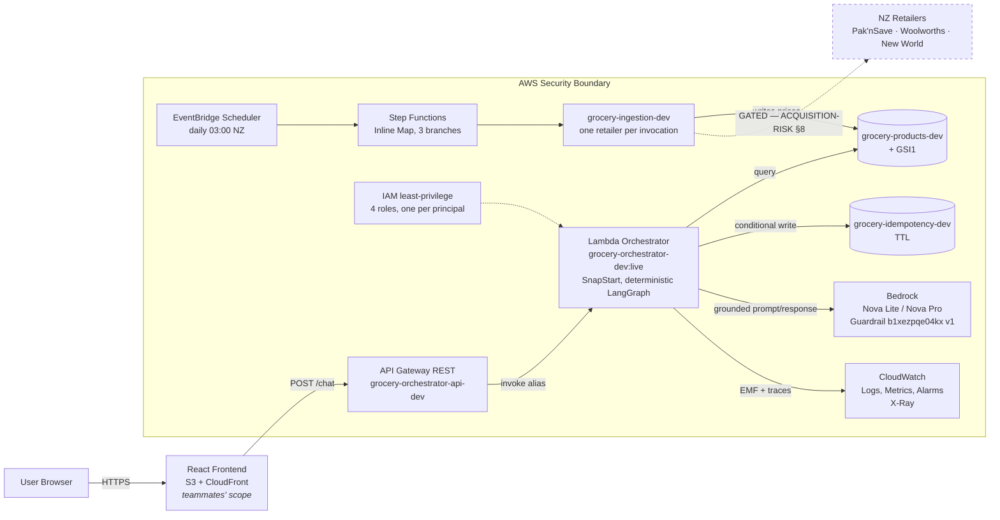

# Deployed architecture — dev

Reconciliation of the reviewed architecture diagram against
`.kiro/specs/design.md` and the `ap-southeast-2` account, plus the record of
what is deployed. Dated 2026-08-27.

This file is the **deployment record**: what exists in the account, what it is
wired to, and what was learned deploying it. `AGENTS.md` remains the working
agreement and `.kiro/specs/` remains the specification — neither is superseded
here. When they disagree with this file, they are describing intent and this
file is describing an account, and both are worth reading.

The diagram was a **presentation view of the architecture already specified**,
not a change to it. Four things needed correcting before it could be built;
those are §2.

---

## 1. Shape

Only the retailer link is dashed. Everything else is deployed and was exercised.

## 2. Corrections applied to the diagram

**The price arrow terminated at Bedrock.** Drawn literally, ingestion would
feed prices into the model rather than into storage, inverting invariant 1 —
no price may originate from model generation. Prices land in
`grocery-products-dev`; Bedrock reads only the prompt the orchestrator builds
from already-retrieved records.

**Step Functions was missing.** The diagram went `EventBridge -> one Lambda ->
three retailers`. `tech.md`, `design.md:33` and `tasks.md:94` all specify
`EventBridge -> Step Functions Inline Map -> per-source adapters`. The specs
win, and the reason is now load-bearing in the deployed definition: `Catch`
sits *inside* the item processor, so a retailer that fails does not abort the
Map and discard the retailers that already succeeded.

**"Sessions" is the idempotency table.** The account has products and
idempotency; there is no sessions table and none is planned for the pilot.
`grocery-idempotency-dev` is already session-scoped with TTL. A genuine
conversation-state store would open a Privacy Act 2020 workstream first —
`security.md` line 25.

**EventBridge and ingestion sat outside the security boundary.** They are AWS
services inside the account. Only the retailer sources are external, and that
is the boundary worth drawing, because it is where untrusted data enters.

## 3. What is deployed

| Resource | Identifier | Notes |
|---|---|---|
| Orchestrator Lambda | `grocery-orchestrator-dev` | python3.13, x86_64, 1024 MB, 30 s, X-Ray Active |
| Published version / alias | `5` / `:live` | SnapStart `OptimizationStatus: On` |
| Orchestrator role | `grocery-orchestrator-dev-role` | `config/iam-orchestrator-role.json` |
| REST API | `grocery-orchestrator-api-dev` (`woqmel35lk`) | regional, stage `dev`, throttle 5 rps / burst 10 |
| Endpoint | `POST /dev/chat` | unauthenticated; see §7 |
| Ingestion Lambda | `grocery-ingestion-dev` | 512 MB, 120 s, handler `ingestion.handler.lambda_handler` |
| Ingestion role | `grocery-ingestion-dev-role` | `config/iam-ingestion-role.json`; read+write on products only, no Bedrock, no idempotency |
| State machine | `grocery-ingestion-dev` | `config/ingestion-state-machine.json` |
| Schedule | `grocery-price-refresh-dev` | `cron(0 3 * * ? *)` Pacific/Auckland, ENABLED |
| Products table | `grocery-products-dev` | 152 items, GSI1, PAY_PER_REQUEST |
| Idempotency table | `grocery-idempotency-dev` | TTL ACTIVE |
| Guardrail | `b1xezpqe04kx` version `1` | DRAFT deliberately not granted in IAM |
| SNS topic | `grocery-orchestrator-alarms-dev` | alarms: handler-escaped, api-5xx |

**One artefact, two functions.** `scripts/build_lambda.py` now includes
`ingestion` in `INCLUDE_DIRS`, and the same `build/lambda.zip` is deployed to
both functions with different handlers. Two zips would mean two builds to keep
in step and two artefacts for the CI `package` job to verify, for about 10 KB
of Python. The functions stay separate — separate roles, separate invocation
paths — and only the artefact is shared.

**x86_64, not arm64.** `build_lambda.py` pins
`--platform manylinux2014_x86_64` and the package carries compiled wheels
(`pydantic_core`, `orjson`, `xxhash`). Architecture is immutable after create,
so it was matched to what CI verifies rather than guessed at.

**The alias is what gets invoked, not `$LATEST`.** SnapStart applies to
published versions only. An integration pointed at the unqualified function ARN
silently forfeits it while still working — nothing breaks, it just gets slower.

## 4. IAM notes worth keeping

**Cross-region inference profiles need two grants.** `config/models.json`
routes through `apac.*` and `au.*` profiles spanning multiple APAC regions.
Granting only the profile ARN produces an `AccessDeniedException` naming a
region nobody configured. The policy grants the profile ARN *and* the
underlying `arn:aws:bedrock:*::foundation-model/...` — account-less because
foundation models are AWS-owned, region-wildcarded because the profile chooses
the region.

**No `cloudwatch:PutMetricData`.** Powertools Metrics emits Embedded Metric
Format to stdout and CloudWatch extracts the metrics from the log records.
Granting PutMetricData would be permission for a call the code never makes.

**GSI1 is a separate resource ARN.** Omitting it yields a working `GetItem` and
a failing cheapest-price `Query` — the exact access pattern the GSI exists for.

**Ingestion cannot read the model or the idempotency table**, and the
orchestrator cannot write prices. Four roles, one per principal.

## 5. Two defects found by deploying, and fixed

Neither was visible offline. Both were found because the deployed system was
exercised against live Bedrock and a real table.

### The prose named a different store than the comparison

`_placeholder_list` deliberately carries no prices — that is the mechanism that
stops the model writing a dollar figure. But `PRICE_CHECK_SYSTEM` also told the
model to "say which store is cheapest", so it was being asked to state a fact it
had been denied the data for. It guessed. Against live Nova the sentence named
Pak'nSave Sylvia Park while `price_comparison` flagged Pak'nSave Mangere.

Both were $2.97, so the tie hid the general defect: **nothing tied the model's
choice to the retrieved prices at all**. On a non-tie it could have named a
dearer store as cheapest — a confident wrong answer, which is what invariant 2
exists to prevent.

Fixed by computing the winner in code and naming it in the prompt
(`cheapest_refs`), and by rejecting prose that cites anything else. The check
is against retrieved records, not against what the model claims — Req 5.4's
rule applied to the price claim. `test_prose_is_dropped_when_it_cites_a_dearer_option`
guards it, and was mutation-tested: with the check disabled that test fails,
which is the only evidence that a guard guards anything. The first test written
for this passed with the check disabled — see §8.

### `usage` was empty on every response

`state["usage"]` was read by `emit_done` and written by nobody. The Bedrock
client recorded per-call usage into `last_usage`; no node lifted it into graph
state, so every deployed response reported `model_ids: []` and null tokens.

Fixed with a `merge_usage` reducer on the state field — a turn makes several
model calls and the contract reports one block, so without a reducer the last
writer would win and a plan turn would report only the prose call. Tokens and
latency sum, model ids deduplicate, `guardrail_intervened` is sticky. Live
responses now carry `["apac.amazon.nova-lite-v1:0"]`, ~2,514 input and ~75
output tokens per price-check turn.

### A third thing worth recording: the guardrail caught the first fix

Moving the cheapest-ref rule into the *user* prompt made every price-check turn
return `GUARDRAIL_BLOCKED`. `src/models/guardrail.py` wraps the user block in
Bedrock input tags precisely so the PROMPT_ATTACK filter applies there — and
imperative sentences inside that region are indistinguishable from an injection
attempt. The rule moved to `PRICE_CHECK_SYSTEM`; the tagged block carries data
only. **Instructions in the system prompt, data in the tagged block.**

This is also the clearest evidence so far that the guardrail is doing real
work, though it is not the qualifying live result Task 3 still needs.

## 6. Verified end to end

`POST /dev/chat` returns HTTP 200 with the contract-valid sequence: `session`,
`intent` (`price_check`, 0.95), five `citation` events each carrying
`source.table/pk/sk`, a `token`, a `price_comparison`, and `done`. Prices
serialise as strings, so the `Decimal`-on-wire convention survived deployment.
Cold ~7.6 s before SnapStart optimisation; ~1.5–5 s after.

The state machine refreshed all three retailers in one execution — 51, 51 and
50 records, totalling the seeded 152 — and the shopper path was re-verified
against the rewritten table.

Gates after the changes: **324 passed, 31 skipped**, ruff clean, intent eval
**76.7% (23/30)** and meal-plan **91% (10/11)** — both unchanged from baseline,
guardrail structural PASS, `validate.py` exit 0. Sample fixtures were
regenerated twice, deliberately: once because `usage` became populated and once
because the system prompt grew by the added rule. Both are intentional
expectation changes, recorded here per the eval-discipline rule.

**Beware the idempotency cache when testing.** Re-posting
`samples/request_price_check.json` returns the stored outcome for that
session/turn pair, not a fresh run. Two fixes appeared inert for a while
because every verification was reading a cached pre-fix response — identical
prose, ~1.5 s latency, empty usage. Use a fresh `session_id` and `turn_id` per
manual test. The cache was working exactly as designed; the verification was
not.

## 6a. Throughput ceiling, measured

The account's Bedrock request-per-minute quotas cap this deployment at roughly
**8 meal-plan turns per minute**, service-wide across all users — about 480 an
hour. The binding limit is Amazon Nova Lite at 20 cross-region requests per
minute, against the 2-3 Nova Lite calls each meal-plan turn makes.

**Nova's request-per-minute quotas are NOT adjustable; Claude's are.** So the
reflex answer to a throughput problem — ask for an increase — is unavailable
for the models this deployment actually routes to. Check `Adjustable` before
planning around one.

Accepted deliberately: the target is a workshop and a demo, where 8/min is
ample, and a throttled call already fails honestly as a retryable
`UPSTREAM_TIMEOUT` rather than producing anything wrong.

Two options for lifting it, with costs and trade-offs, are recorded in
`docs/THROUGHPUT-AND-SCALING.md` for whoever takes this to production. Read
that before assuming a quota request is the fix.

One operational note worth carrying: throttling hits the TAIL of a busy
period, so errors cluster late rather than spreading evenly. In the eval
harness that pattern read as "the model failed those cases" and cost three
model bands before anyone checked the quota. A dashboard showing the same
shape is throttling, not model quality.

## 7. What is still not built, and why

**Live retailer acquisition stays gated** on the thirteen conditions in
`ACQUISITION-RISK.md` §8. Condition 1 — a human reading the three unretrieved
sources — is not met. `ingestion/sources.py` enforces this in code:
`resolve_source` raises `NotImplementedError` if `LIVE_ACQUISITION=1` rather
than falling back quietly, because a misconfiguration that silently starts
requesting retailer sites is the §4.2 exposure. Nothing in the repo sets that
variable. The tripwire exists so adding a live adapter requires deleting a line
that says why it is there.

**No S3 bucket.** Ingestion returns counts and writes to DynamoDB; nothing
produces a snapshot artefact yet. Creating the bucket now would be
infrastructure that reads as a capability and does nothing.

**Frontend hosting is teammates' scope.** `AGENTS.md` line 4 still holds. The
S3 + CloudFront box is an external consumer of `POST /chat`, and
`CONTRACT-v1.md` remains the interface they build against.

**`POST /dev/chat` is unauthenticated**, protected only by stage throttling at
5 rps / burst 10. Adequate for a dev stage with a public sample payload and
nothing more. Task 8.7 covers usage plans; WAF and Cognito are ADR 0002
companions.

**API Gateway execution logging is off.** It needs an account-level CloudWatch
Logs role ARN that is not set. Stage metrics and throttling work without it.

**Claude routes remain blocked.** `au.anthropic.*` inference profiles show
ACTIVE, which is misleading — invoking returns `ResourceNotFoundException:
Model use case details have not been submitted for this account`. Profile
availability is not account entitlement. Nova is unaffected and is what
`models.json` routes to.

**The pilot blockers in `AGENTS.md` are not discharged by any of this.** Exact
retrieved-record equality, `run_turn()` whole-response money enforcement, and a
qualifying live Guardrail result all remain open. Deployment proves wiring, not
correctness.

## 8. What the review round changed

`/code-review` over the working tree returned eleven findings. Three were high
severity and one had already reached the account. All are fixed; the account
was reconciled before anything else.

**`unit_price()` corrupted live data.** It dropped
`scripts/generate_fixtures.py`'s `if grams > 1` guard, so `pack_grams: 1` --
the sentinel for "sold each", not "weighs one gram" -- was divided into rather
than passed through. The first scheduled-shape run wrote
`unit_price_nzd: "2490.00"` against a $2.49 broccoli, across six rows, into
`grocery-products-dev`. `unit_price_nzd` is read straight into the Citation the
shopper sees, so this was a wrong price on the wire, which is the one class of
error this project is built to make impossible.

Handled in that order: schedule disabled so 03:00 could not repeat it, table
restored from `fixtures/products.json`, `unit_price()` fixed (guard restored,
rounding changed from ROUND_HALF_UP to the generator's default ROUND_HALF_EVEN
so a refresh is genuinely idempotent), ingestion re-run, all 152 live rows
diffed field-by-field against the fixtures -- zero mismatches -- and only then
the schedule re-enabled.

The guard that now exists is `test_ingestion_reproduces_the_seeded_records_exactly`,
which compares every field of every record ingestion produces against the seed.
It did not exist before; the unit tests all passed while the output was wrong,
because none of them compared ingestion's output to the thing it reproduces.

**`usage_from` double-counted on failed calls.** `BedrockModelClient` assigns
`self._usage` only after `converse` returns, so a call raising `ModelError`
leaves the previous call's numbers in place -- and `merge_usage` added them
again. A meal plan whose generation throttled through two repairs billed
`classify_intent`'s tokens four times, over-reporting on exactly the turns that
failed. `usage_from` now takes the reading captured before the call and drops an
unchanged one, the same guard `InstrumentedModelClient._call` already applied to
its telemetry. A guardrail block is deliberately not that case: `converse`
returned and wrote fresh usage before the stop reason was inspected.

**The prose guard rejected output the prompt asked for.** `PRICE_CHECK_SYSTEM`
still offered "how it compares with the dearest option" while the new check
forbade citing any non-cheapest ref, so a sentence taking that branch was
silently dropped. The prompt now directs the comparison through `[[savings]]`,
which renders to a non-monetary label and cites no store.

**`dynamodb:Scan` was missing from the orchestrator role**, so every meal-plan
turn would have failed `AccessDenied` -- `candidates_for_budget` pages the base
table. It went unnoticed because the smoke test only ever exercised a price
check. Granted, and the meal-plan path verified end to end for the first time.

**The Step Functions `Catch` could not fire.** `ResultPath: "$.error"` against a
scalar Map item raises `States.ResultPathMatchFailure`, which aborts the Map --
the exact coupling the Catch exists to prevent. It never showed because no
branch had failed. Now `ResultPath: null`.

Also fixed: a vacuous test that passed with the code it claimed to guard
disabled (removed, replaced by the mutation-tested one above); `latency_ms: null`
published beside real token counts because the fixture carry-forward preserved a
null over a newly-populated field; two hand-authored samples still teaching
`model_ids: []` to the frontend, now carrying observed live values; the archive's
second entrypoint going unverified by `verify_import`; a duplicated config note
key; and `scripts/apply_iam.py`, which the config file had claimed as its applier
before it existed -- the policy had been hand-applied twice, which is how the
missing `Scan` survived review of a file that looked complete.

### The process fix: ingestion diffs before it writes

The code defect was one thing; the reason it became a *data* incident was that
the refresh was run straight at the live table with no dry-run and no diff.
Nothing compared what was about to be written against what was there, so six
rows changed value with no signal at all.

`refresh()` now queries the rows it is about to overwrite and reports
`added`/`changed`/`unchanged` plus a sample of which fields moved and from what
to what. `{"retailer": ..., "dry_run": true}` does the whole job and writes
nothing. The counts land in the Step Functions execution history, so the
scheduled run is now self-evidencing: three branches reporting `changed=0`
against unchanged fixtures is idempotency demonstrated rather than claimed.

It is deliberately **not** a threshold interlock. With live acquisition a
genuine special can move a real share of a retailer's catalogue, so a
percentage gate would either be too loose to catch a defect or would refuse
legitimate refreshes. Visibility after the fact is the honest control; a gate
that cries wolf gets disabled.

This cost the ingestion role one permission. It was write-only, and a
write-only writer cannot know what it is about to change, which is the shape of
the original problem stated as an IAM policy. It now has `dynamodb:Query` on
the base table — the smallest grant that makes the write reportable.

### Config carries placeholders, not an account id

This repository is public, and the config files this work added originally
hardcoded the account id into every ARN. The id is not a credential, and it was
already present in `DYNAMODB-SCHEMA.md` and `tasks.md`, so nothing was newly
exposed — but it is the wrong default twice over: it pins each file to one
account, contradicting the "reproducible in another account" line every config
header carries, and it hands a reader a concrete enumeration target for
nothing in return.

Config now carries `${AWS_ACCOUNT_ID}` and `${AWS_REGION}`.
`scripts/aws_placeholders.py` resolves them at apply time — the account from
STS, so it is by construction the account being deployed to and cannot drift
from the file the way a literal can; the region from the config's own `region`
field. `assert_resolved()` refuses to apply a half-substituted document,
because some AWS APIs accept `${AWS_ACCOUNT_ID}` as a literal ARN segment and
fail later at use rather than at apply.

`tests/test_config_placeholders.py` fails the build if a twelve-digit id
reappears in `config/`. That guard exists because this is exactly the kind of
rule that decays: the next person adding a resource pastes the ARN from the
console, and it reads as correct — because it is correct, for one account.

`scripts/apply_state_machine.py` was added at the same time, for the same
reason `apply_iam.py` was: the definition had been applied by hand, and the
`Catch`/`ResultPath` defect survived precisely because nothing re-derived the
deployed definition from the file.

**This is hygiene, not redaction.** The id is in this repository's git history
and history is not meaningfully rewritable on a public repo with forks. Treat
the existing value as public, because it is. What changes is that new work does
not add more, and CI now says so.

### The lesson worth keeping

Every one of the three high-severity findings was invisible to a green test
suite, and two were invisible to a successful live invocation. The suite passed
324 tests while ingestion wrote a wrong price to production data. What caught
them was diffing output against the thing it was supposed to reproduce, and
disabling a guard to watch its test fail. `AGENTS.md` already says this --
"assume the check is the thing that is broken until you have watched it fail" --
and this round is the seventh entry in that list.
